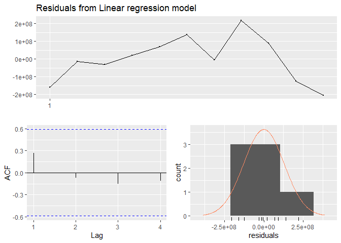
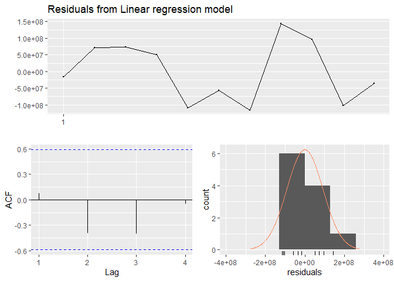
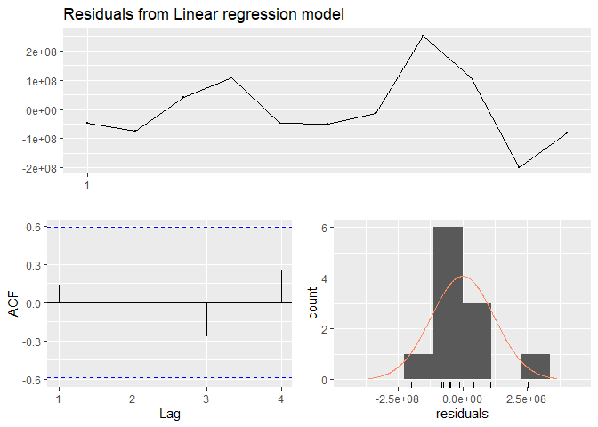
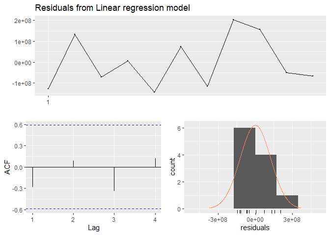
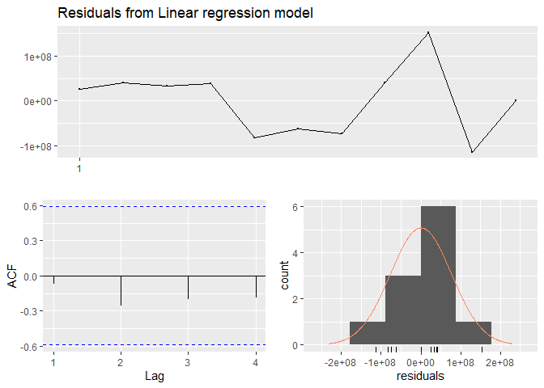
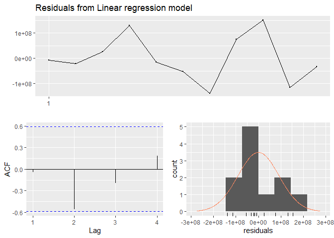
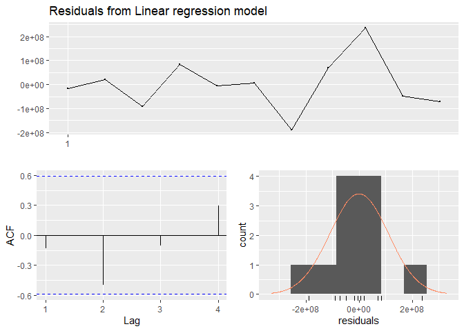

EDA - Pacific AIS Data
================
Avin Datt - PacifImpact
06 September 2020

# Scope

1.  Explore data features. Understand summary and values.
2.  Apply algorithms to reduce noise as outlined by
    [UNSTATS](https://unstats.un.org/wiki/display/AIS/AIS+data+at+the+UN+Global+Platform).
3.  Create new data features using draught, time and other dimensions.
4.  Create common model to share that can be used in conjunction with
    trade, and economic research by PacifImpact.

# Load Libraries

``` r
# Load data.table library
if (!require(data.table)) {
  install.packages("data.table")
  library(data.table)
}
```

    ## Loading required package: data.table

``` r
# Load DBI library
if (!require(DBI)) {
  install.packages("DBI")
  library(DBI)
}
```

    ## Loading required package: DBI

``` r
# Load DBI library
if (!require(RPostgres)) {
  install.packages("RPostgres")
  library(RPostgres)
}
```

    ## Loading required package: RPostgres

``` r
# Load SmartEDA library
if (!require(SmartEDA)) {
  install.packages("SmartEDA")
  library(SmartEDA)
}
```

    ## Loading required package: SmartEDA

    ## Registered S3 method overwritten by 'GGally':
    ##   method from   
    ##   +.gg   ggplot2

# Read AIS Cook Islands.

Read the files extracted from UNGP for Cook Islands.

``` r
# Cook Islands. files
file.list <- list.files(
  path = "./data/external/ais_ck/", 
  pattern='*.csv'
  )


# Read files in bulk
cklist.list <- lapply(
  paste0("./data/external/ais_ck/",
         file.list),
  fread
  )


# turn into one table 
cklist.list <- rbindlist(
  cklist.list
  )


head(cklist.list)
```

<div class="kable-table">

| dtg                       |      mmsi | vessel\_name | callsign | vessel\_type\_code | vessel\_class | length | width | flag\_country | flag\_code |  longitude |   latitude | UDF:st\_asText(position)                        | vessel\_type | vessel\_type\_cargo       | vessel\_type\_main | vessel\_type\_sub | destination |     eta | draught | sog |   cog | rot | heading | nav\_status            | nav\_status\_code | source | message\_type |
| :------------------------ | --------: | :----------- | :------- | -----------------: | :------------ | -----: | ----: | :------------ | ---------: | ---------: | ---------: | :---------------------------------------------- | :----------- | :------------------------ | :----------------- | :---------------- | :---------- | ------: | ------: | --: | ----: | --: | ------: | :--------------------- | ----------------: | :----- | ------------: |
| 2019-09-04 21:27:08+00:00 | 367551910 | CHANTICLEER  | WDG5941  |                 36 | B             |     13 |     4 | USA           |        367 | \-159.7851 | \-21.20482 | POINT (-159.78505333333334 -21.204818333333332) | Sailing      |                           |                    |                   | B 2 A       |    2460 |       0 | 0.2 | 215.1 |   0 |       0 | Unknown                |                16 | S-AIS  |            18 |
| 2019-09-04 22:39:07+00:00 | 367551910 | CHANTICLEER  | WDG5941  |                 36 | B             |     13 |     4 | USA           |        367 | \-159.7850 | \-21.20483 | POINT (-159.78504 -21.20483)                    | Sailing      |                           |                    |                   | B 2 A       |    2460 |       0 | 0.1 |   0.0 |   0 |       0 | Unknown                |                16 | S-AIS  |            18 |
| 2019-09-04 23:06:07+00:00 | 367551910 | CHANTICLEER  | WDG5941  |                 36 | B             |     13 |     4 | USA           |        367 | \-159.7851 | \-21.20483 | POINT (-159.78505333333334 -21.204826666666666) | Sailing      |                           |                    |                   | B 2 A       |    2460 |       0 | 0.2 |  63.3 |   0 |       0 | Unknown                |                16 | S-AIS  |            18 |
| 2019-09-04 23:06:08+00:00 | 367551910 | CHANTICLEER  | WDG5941  |                 36 | B             |     13 |     4 | USA           |        367 | \-159.7851 | \-21.20483 | POINT (-159.78505333333334 -21.204826666666666) | Sailing      |                           |                    |                   | B 2 A       |    2460 |       0 | 0.2 |  63.3 |   0 |       0 | Unknown                |                16 | S-AIS  |            18 |
| 2019-09-04 23:45:08+00:00 | 367551910 | CHANTICLEER  | WDG5941  |                 36 | B             |     13 |     4 | USA           |        367 | \-159.7851 | \-21.20483 | POINT (-159.78505333333334 -21.204833333333333) | Sailing      |                           |                    |                   | B 2 A       |    2460 |       0 | 0.3 | 251.0 |   0 |       0 | Unknown                |                16 | S-AIS  |            18 |
| 2019-09-05 18:40:52+00:00 | 518100443 | GRINNA2      | E5U3358  |                 79 | A             |     38 |     9 | Cook Islands  |        518 | \-159.7847 | \-21.20506 | POINT (-159.78468 -21.205055)                   | Cargo        | No Additional Information |                    |                   | RAROTONGA   | 8260830 |       3 | 0.2 | 313.9 |   0 |     123 | Under Way Using Engine |                 0 | S-AIS  |             1 |

</div>

## Exploration

1.  Convert dtg and eta to as.POSIXct(x, tz = "", …)

<!-- end list -->

``` r
# Change from char to posixct 
cklist.list[,
            `:=` (dtg = gsub("T",
                             " ",
                             dtg
                             )
                  )][,
                     `:=` (dtg = gsub(".000Z",
                             "",
                             dtg
                             )
                           )]


cklist.list[,
            `:=` (dtg = strptime(dtg, "%Y-%m-%d %H:%M:%S")
                  )]
```

    ## Warning in strptime(dtg, "%Y-%m-%d %H:%M:%S"): strptime() usage detected and
    ## wrapped with as.POSIXct(). This is to minimize the chance of assigning POSIXlt
    ## columns, which use 40+ bytes to store one date (versus 8 for POSIXct). Use
    ## as.POSIXct() (which will call strptime() as needed internally) to avoid this
    ## warning.

``` r
# check summary 
cklist.list[,
            summary(dtg)]
```

    ##                  Min.               1st Qu.                Median 
    ## "2018-12-01 00:00:02" "2019-02-08 22:11:39" "2019-05-23 02:39:59" 
    ##                  Mean               3rd Qu.                  Max. 
    ## "2019-06-26 09:54:13" "2019-10-04 14:43:38" "2020-09-01 00:37:12" 
    ##                  NA's 
    ##                   "2"

``` r
# Check out dataset quality
ExpData(
  data = cklist.list,
  type = 1
  )
```

<div class="kable-table">

| Descriptions                                          | Value       |
| :---------------------------------------------------- | :---------- |
| Sample size (nrow)                                    | 469496      |
| No. of variables (ncol)                               | 28          |
| No. of numeric/interger variables                     | 15          |
| No. of factor variables                               | 0           |
| No. of text variables                                 | 12          |
| No. of logical variables                              | 0           |
| No. of identifier variables                           | 0           |
| No. of date variables                                 | 1           |
| No. of zero variance variables (uniform)              | 0           |
| %. of variables having complete cases                 | 67.86% (19) |
| %. of variables having \>0% and \<50% missing cases   | 25% (7)     |
| %. of variables having \>=50% and \<90% missing cases | 7.14% (2)   |
| %. of variables having \>=90% missing cases           | 0% (0)      |

</div>

``` r
# Check out data feature quality
ExpData(
  data = cklist.list,
  type = 2
  )
```

<div class="kable-table">

| Index | Variable\_Name           | Variable\_Type | Per\_of\_Missing | No\_of\_distinct\_values |
| ----: | :----------------------- | :------------- | ---------------: | -----------------------: |
|     1 | dtg                      | POSIXct:POSIXt |          0.00000 |                   466413 |
|     2 | mmsi                     | integer        |          0.00000 |                      197 |
|     3 | vessel\_name             | character      |          0.00000 |                      149 |
|     4 | callsign                 | character      |          0.00535 |                      261 |
|     5 | vessel\_type\_code       | numeric        |          0.00004 |                       25 |
|     6 | vessel\_class            | character      |          0.00000 |                        2 |
|     7 | length                   | numeric        |          0.00001 |                      104 |
|     8 | width                    | numeric        |          0.00000 |                       41 |
|     9 | flag\_country            | character      |          0.01180 |                       56 |
|    10 | flag\_code               | numeric        |          0.00042 |                       76 |
|    11 | longitude                | numeric        |          0.00000 |                     7429 |
|    12 | latitude                 | numeric        |          0.00000 |                     8251 |
|    13 | UDF:st\_asText(position) | character      |          0.00000 |                    86971 |
|    14 | vessel\_type             | character      |          0.00000 |                       16 |
|    15 | vessel\_type\_cargo      | character      |          0.78996 |                        5 |
|    16 | vessel\_type\_main       | character      |          0.40622 |                       15 |
|    17 | vessel\_type\_sub        | character      |          0.54841 |                       15 |
|    18 | destination              | character      |          0.04255 |                      215 |
|    19 | eta                      | integer        |          0.00000 |                      332 |
|    20 | draught                  | numeric        |          0.00000 |                       47 |
|    21 | sog                      | numeric        |          0.00000 |                      138 |
|    22 | cog                      | numeric        |          0.00000 |                     3601 |
|    23 | rot                      | numeric        |          0.00000 |                       57 |
|    24 | heading                  | numeric        |          0.00000 |                      360 |
|    25 | nav\_status              | character      |          0.00000 |                        8 |
|    26 | nav\_status\_code        | integer        |          0.00000 |                        8 |
|    27 | source                   | character      |          0.00000 |                        2 |
|    28 | message\_type            | integer        |          0.00000 |                        5 |

</div>

``` r
# Statistics for Numerical features 
data.table(
  ExpNumStat(
    cklist.list,
    by = "A",
    gp = NULL,
    Qnt = NULL,
    Nlim = 10,
    MesofShape = 2,
    Outlier = TRUE,
    round = 3,
    dcast = FALSE,
    val = NULL
  )
)
```

<div class="kable-table">

| Vname              | Group |     TN |   nNeg |  nZero |   nPos | NegInf | PosInf | NA\_Value | Per\_of\_Missing |            sum |          min |           max |          mean |        median |           SD |        CV |          IQR | Skewness | Kurtosis |        LB.25% |        UB.75% | nOutliers |
| :----------------- | :---- | -----: | -----: | -----: | -----: | -----: | -----: | --------: | ---------------: | -------------: | -----------: | ------------: | ------------: | ------------: | -----------: | --------: | -----------: | -------: | -------: | ------------: | ------------: | --------: |
| cog                | All   | 469496 |      0 | 130600 | 338896 |      0 |      0 |         0 |            0.000 |   6.790534e+07 |        0.000 |       363.200 |       144.635 |       144.800 | 1.237480e+02 |     0.856 | 2.684000e+02 |    0.107 |  \-1.521 |     \-402.600 |       671.000 |         0 |
| draught            | All   | 469496 |      0 |  83361 | 386135 |      0 |      0 |         0 |            0.000 |   1.455538e+06 |        0.000 |        12.900 |         3.100 |         2.500 | 2.206000e+00 |     0.712 | 6.000000e-01 |    0.604 |  \-0.271 |         1.600 |         4.000 |    189962 |
| eta                | All   | 469496 |      0 |      0 | 469496 |      0 |      0 |         0 |            0.000 |   2.184308e+12 |      101.000 |  12311800.000 |   4652452.449 |   3291700.000 | 4.308342e+06 |     0.926 | 7.120130e+06 |    0.635 |  \-1.072 | \-9539495.000 |  18941025.000 |         0 |
| flag\_code         | All   | 469496 |      0 |      0 | 469300 |      0 |      0 |       196 |            0.042 |   2.076162e+08 |      100.000 |       982.000 |       442.395 |       518.000 | 1.109910e+02 |     0.251 | 2.070000e+02 |  \-0.586 |    0.082 |         0.500 |       828.500 |       929 |
| heading            | All   | 469496 |      0 | 123660 | 345836 |      0 |      0 |         0 |            0.000 |   2.409450e+07 |        0.000 |       359.000 |        51.320 |        13.000 | 7.638900e+01 |     1.488 | 8.500000e+01 |    1.993 |    3.698 |     \-127.500 |       212.500 |     25935 |
| latitude           | All   | 469496 | 469496 |      0 |      0 |      0 |      0 |         0 |            0.000 | \-9.954630e+06 |     \-21.210 |      \-21.190 |      \-21.203 |      \-21.205 | 3.000000e-03 |     0.000 | 1.000000e-03 |    1.738 |    1.700 |      \-21.207 |      \-21.201 |     86333 |
| length             | All   | 469496 |      0 |  24669 | 444823 |      0 |      0 |         4 |            0.001 |   3.181307e+07 |        0.000 |       547.000 |        67.761 |        47.000 | 4.765600e+01 |     0.703 | 7.800000e+01 |    1.483 |    2.776 |      \-79.000 |       233.000 |      5020 |
| longitude          | All   | 469496 | 469496 |      0 |      0 |      0 |      0 |         0 |            0.000 | \-7.501828e+07 |    \-159.797 |     \-159.775 |     \-159.785 |     \-159.784 | 2.000000e-03 |     0.000 | 1.000000e-03 |  \-1.364 |    4.516 |     \-159.786 |     \-159.783 |     77409 |
| mmsi               | All   | 469496 |      0 |      0 | 469496 |      0 |      0 |         0 |            0.000 |   2.077754e+14 | 98336985.000 | 982470105.000 | 442549781.412 | 518100275.000 | 1.109779e+08 |     0.251 | 2.064483e+08 |  \-0.591 |    0.106 |   1979587.500 | 827772687.500 |       929 |
| rot                | All   | 469496 |   1876 | 465919 |   1701 |      0 |      0 |         0 |            0.000 | \-8.227210e+02 |     \-57.854 |        45.712 |       \-0.002 |         0.000 | 1.340000e+00 | \-764.868 | 0.000000e+00 |  \-0.494 |  440.533 |         0.000 |         0.000 |      3577 |
| sog                | All   | 469496 |      0 | 240679 | 228817 |      0 |      0 |         0 |            0.000 |   1.571779e+05 |        0.000 |        23.000 |         0.335 |         0.000 | 1.249000e+00 |     3.730 | 1.000000e-01 |    6.560 |   56.358 |       \-0.150 |         0.250 |     59069 |
| vessel\_type\_code | All   | 469496 |      0 |     14 | 469464 |      0 |      0 |        18 |            0.004 |   3.182007e+07 |        0.000 |       100.000 |        67.778 |        70.000 | 2.024100e+01 |     0.299 | 1.000000e+00 |  \-0.405 |  \-0.302 |        67.500 |        71.500 |    223577 |
| width              | All   | 469496 |      0 |  24672 | 444822 |      0 |      0 |         2 |            0.000 |   5.793460e+06 |        0.000 |        60.000 |        12.340 |        11.000 | 5.689000e+00 |     0.461 | 7.000000e+00 |    0.879 |    3.002 |       \-1.500 |        26.500 |     14013 |

</div>

## Definitions Numerical Features

[Definitions available in
pdf](https://unstats.un.org/wiki/display/AIS/AIS+data+at+the+UN+Global+Platform?preview=/57999715/72778218/UNGP%20-%20AIS%20ADSB%20JupyterHubNotebookQueryGuide.pdf#AISdataattheUNGlobalPlatform-Step-by-stepguidelinesforexecutingthesamplescriptsonUNGP)

**cog:** Course over Ground \[Degrees\]

**draught:** Vessel Draught \[Metres\]

**eta:** Month, Day, Hour, and Minute of Estimated Time of Arrival in
UTC \[MMDDHHmm\]

**flag\_code:** Country of Registration Code

**heading:** Heading \[Degrees\]

**latitude:** WGS 84 Latitude Coordinate \[Decimal Degrees\]

**length:** Length of Bow to Main Tower and Main Tower to Stern
\[Meters\]

**longitude:** WGS 84 Longitude Coordinate \[Decimal Degrees\]

**mmsi:** Maritime Mobile Service Identity (MMSI)

**rot:** Rate of Turn \[Degrees / Min\]

**sog:** Speed over Ground \[Knots\]

**vessel\_type\_code**:\* Vessel Type Code

**width:** Length of Port to Main Tower and Main Tower to Starboard
\[Meters\]

``` r
# Statistics for Numerical features by Vessel Type
data.table(
  ExpNumStat(
    cklist.list,
    by = "GA",
    gp = "vessel_type",
    Qnt = NULL,
    Nlim = 10,
    MesofShape = 2,
    Outlier = TRUE,
    round = 3,
    dcast = FALSE,
    val = NULL
  )
)[order(-TN),
  head(.SD,
       10),
  by = Vname]
```

    ## Warning in min(x, na.rm = T): no non-missing arguments to min; returning Inf

    ## Warning in max(x, na.rm = T): no non-missing arguments to max; returning -Inf

<div class="kable-table">

| Vname              | Group                       |     TN |   nNeg |  nZero |   nPos | NegInf | PosInf | NA\_Value | Per\_of\_Missing |            sum |           min |           max |          mean |        median |           SD |        CV |          IQR |  Skewness |   Kurtosis |         LB.25% |        UB.75% | nOutliers |
| :----------------- | :-------------------------- | -----: | -----: | -----: | -----: | -----: | -----: | --------: | ---------------: | -------------: | ------------: | ------------: | ------------: | ------------: | -----------: | --------: | -----------: | --------: | ---------: | -------------: | ------------: | --------: |
| cog                | vessel\_type:All            | 469496 |      0 | 130600 | 338896 |      0 |      0 |         0 |            0.000 |   6.790534e+07 |         0.000 |       363.200 |       144.635 |       144.800 | 1.237480e+02 |     0.856 | 2.684000e+02 |     0.107 |    \-1.521 |      \-402.600 |       671.000 |         0 |
| cog                | vessel\_type:Cargo          | 262530 |      0 | 111754 | 150776 |      0 |      0 |         0 |            0.000 |   2.953527e+07 |         0.000 |       363.200 |       112.502 |        64.000 | 1.198480e+02 |     1.065 | 2.130000e+02 |     0.472 |    \-1.315 |      \-319.500 |       532.500 |         0 |
| cog                | vessel\_type:Other          |  65002 |      0 |   7940 |  57062 |      0 |      0 |         0 |            0.000 |   1.449850e+07 |         0.000 |       359.900 |       223.047 |       292.800 | 1.120900e+02 |     0.503 | 1.715000e+02 |   \-1.012 |    \-0.543 |      \-127.050 |       558.950 |         0 |
| cog                | vessel\_type:Fishing        |  46555 |      0 |   4722 |  41833 |      0 |      0 |         0 |            0.000 |   7.988784e+06 |         0.000 |       359.900 |       171.599 |       174.800 | 1.170940e+02 |     0.682 | 2.093000e+02 |   \-0.037 |    \-1.267 |      \-253.350 |       583.850 |         0 |
| cog                | vessel\_type:Passenger      |  27221 |      0 |     22 |  27199 |      0 |      0 |         0 |            0.000 |   4.847011e+06 |         0.000 |       359.900 |       178.061 |       177.900 | 1.004010e+02 |     0.564 | 1.702000e+02 |     0.003 |    \-1.111 |      \-163.000 |       517.800 |         0 |
| cog                | vessel\_type:Sailing        |  15651 |      0 |   5545 |  10106 |      0 |      0 |         0 |            0.000 |   1.840505e+06 |         0.000 |       359.900 |       117.597 |       109.800 | 1.169890e+02 |     0.995 | 2.090000e+02 |     0.514 |    \-1.120 |      \-313.500 |       522.500 |         0 |
| cog                | vessel\_type:Pleasure Craft |  14316 |      0 |    497 |  13819 |      0 |      0 |         0 |            0.000 |   3.420551e+06 |         0.000 |       359.900 |       238.932 |       259.700 | 8.714000e+01 |     0.365 | 8.840000e+01 |   \-1.402 |      1.638 |         74.600 |       428.200 |      1282 |
| cog                | vessel\_type:Military       |  13022 |      0 |      0 |  13022 |      0 |      0 |         0 |            0.000 |   2.348597e+06 |         0.100 |       359.900 |       180.356 |       183.750 | 1.069740e+02 |     0.593 | 1.990000e+02 |     0.014 |    \-1.437 |      \-217.600 |       578.400 |         0 |
| cog                | vessel\_type:Unknown        |  12138 |      0 |     66 |  12072 |      0 |      0 |         0 |            0.000 |   2.199352e+06 |         0.000 |       359.800 |       181.196 |       179.200 | 1.037740e+02 |     0.573 | 1.821000e+02 |   \-0.008 |    \-1.229 |      \-180.050 |       548.350 |         0 |
| cog                | vessel\_type:Tanker         |  11226 |      0 |      6 |  11220 |      0 |      0 |         0 |            0.000 |   9.144394e+05 |         0.000 |       359.000 |        81.457 |         7.900 | 1.039730e+02 |     1.276 | 1.644000e+02 |     1.050 |    \-0.262 |      \-238.700 |       418.900 |         0 |
| draught            | vessel\_type:All            | 469496 |      0 |  83361 | 386135 |      0 |      0 |         0 |            0.000 |   1.455538e+06 |         0.000 |        12.900 |         3.100 |         2.500 | 2.206000e+00 |     0.712 | 6.000000e-01 |     0.604 |    \-0.271 |          1.600 |         4.000 |    189962 |
| draught            | vessel\_type:Cargo          | 262530 |      0 |   7254 | 255276 |      0 |      0 |         0 |            0.000 |   9.099755e+05 |         0.000 |         7.600 |         3.466 |         2.500 | 1.904000e+00 |     0.549 | 5.000000e-01 |     1.089 |    \-0.173 |          1.750 |         3.750 |     66706 |
| draught            | vessel\_type:Other          |  65002 |      0 |   1516 |  63486 |      0 |      0 |         0 |            0.000 |   2.066212e+05 |         0.000 |         6.500 |         3.179 |         3.100 | 8.400000e-01 |     0.264 | 0.000000e+00 |     0.903 |     10.022 |          3.100 |         3.100 |     27527 |
| draught            | vessel\_type:Fishing        |  46555 |      0 |  43246 |   3309 |      0 |      0 |         0 |            0.000 |   1.523880e+04 |         0.000 |         5.000 |         0.327 |         0.000 | 1.186000e+00 |     3.624 | 0.000000e+00 |     3.365 |      9.394 |          0.000 |         0.000 |      3309 |
| draught            | vessel\_type:Passenger      |  27221 |      0 |    915 |  26306 |      0 |      0 |         0 |            0.000 |   1.764324e+05 |         0.000 |         8.100 |         6.481 |         7.500 | 1.742000e+00 |     0.269 | 2.600000e+00 |   \-1.660 |      3.814 |          1.300 |        11.700 |       915 |
| draught            | vessel\_type:Sailing        |  15651 |      0 |   4221 |  11430 |      0 |      0 |         0 |            0.000 |   3.448320e+04 |         0.000 |         4.300 |         2.203 |         2.800 | 1.413000e+00 |     0.641 | 2.800000e+00 |   \-0.631 |    \-0.872 |        \-4.200 |         7.000 |         0 |
| draught            | vessel\_type:Pleasure Craft |  14316 |      0 |    386 |  13930 |      0 |      0 |         0 |            0.000 |   3.766230e+04 |         0.000 |         3.000 |         2.631 |         2.700 | 4.830000e-01 |     0.183 | 0.000000e+00 |   \-4.388 |     20.948 |          2.700 |         2.700 |      3863 |
| draught            | vessel\_type:Military       |  13022 |      0 |  12804 |    218 |      0 |      0 |         0 |            0.000 |   9.156000e+02 |         0.000 |         4.200 |         0.070 |         0.000 | 5.390000e-01 |     7.664 | 0.000000e+00 |     7.533 |     54.751 |          0.000 |         0.000 |       218 |
| draught            | vessel\_type:Unknown        |  12138 |      0 |  12119 |     19 |      0 |      0 |         0 |            0.000 |   2.277000e+02 |         0.000 |        12.900 |         0.019 |         0.000 | 4.810000e-01 |    25.649 | 0.000000e+00 |    26.088 |    685.978 |          0.000 |         0.000 |        19 |
| draught            | vessel\_type:Tanker         |  11226 |      0 |      8 |  11218 |      0 |      0 |         0 |            0.000 |   7.226310e+04 |         0.000 |         7.000 |         6.437 |         7.000 | 8.390000e-01 |     0.130 | 1.200000e+00 |   \-1.465 |      2.484 |          4.000 |         8.800 |        13 |
| eta                | vessel\_type:All            | 469496 |      0 |      0 | 469496 |      0 |      0 |         0 |            0.000 |   2.184308e+12 |       101.000 |  12311800.000 |   4652452.449 |   3291700.000 | 4.308342e+06 |     0.926 | 7.120130e+06 |     0.635 |    \-1.072 |  \-9539495.000 |  18941025.000 |         0 |
| eta                | vessel\_type:Cargo          | 262530 |      0 |      0 | 262530 |      0 |      0 |         0 |            0.000 |   1.333550e+12 |      2460.000 |  12311500.000 |   5079611.785 |   3291700.000 | 4.203967e+06 |     0.828 | 7.120130e+06 |     0.682 |    \-1.102 |  \-9539495.000 |  18941025.000 |         0 |
| eta                | vessel\_type:Other          |  65002 |      0 |      0 |  65002 |      0 |      0 |         0 |            0.000 |   5.067360e+11 |      2460.000 |  12250830.000 |   7795699.223 |   9281300.000 | 3.083240e+06 |     0.396 | 4.970800e+06 |   \-0.443 |    \-0.429 |  \-2305500.000 |  17577700.000 |         0 |
| eta                | vessel\_type:Fishing        |  46555 |      0 |      0 |  46555 |      0 |      0 |         0 |            0.000 |   3.531749e+10 |       101.000 |  12210900.000 |    758618.522 |       101.000 | 2.789962e+06 |     3.678 | 0.000000e+00 |     3.521 |     10.750 |        101.000 |       101.000 |      9701 |
| eta                | vessel\_type:Passenger      |  27221 |      0 |      0 |  27221 |      0 |      0 |         0 |            0.000 |   1.361351e+11 |      2460.000 |  12311715.000 |   5001106.350 |   3131700.000 | 3.678485e+06 |     0.736 | 5.830030e+06 |     0.798 |    \-0.787 |  \-6503330.000 |  16816790.000 |         0 |
| eta                | vessel\_type:Sailing        |  15651 |      0 |      0 |  15651 |      0 |      0 |         0 |            0.000 |   7.065075e+10 |       400.000 |  12302300.000 |   4514136.228 |   1231930.000 | 5.161205e+06 |     1.143 | 1.229984e+07 |     0.725 |    \-1.293 | \-18447300.000 |  30752060.000 |         0 |
| eta                | vessel\_type:Pleasure Craft |  14316 |      0 |      0 |  14316 |      0 |      0 |         0 |            0.000 |   2.655532e+10 |      1100.000 |  12231800.000 |   1854940.044 |      2460.000 | 3.762676e+06 |     2.028 | 0.000000e+00 |     1.866 |      2.041 |       2460.000 |      2460.000 |      3500 |
| eta                | vessel\_type:Military       |  13022 |      0 |      0 |  13022 |      0 |      0 |         0 |            0.000 |   4.473502e+07 |      2460.000 |     60721.000 |      3435.342 |      2460.000 | 7.475117e+03 |     2.176 | 0.000000e+00 |     7.533 |     54.751 |       2460.000 |      2460.000 |       218 |
| eta                | vessel\_type:Unknown        |  12138 |      0 |      0 |  12138 |      0 |      0 |         0 |            0.000 |   1.234368e+10 |      2460.000 |  10023116.000 |   1016945.200 |   1010000.000 | 3.221852e+05 |     0.317 | 0.000000e+00 |    24.050 |    620.207 |    1010000.000 |   1010000.000 |        82 |
| eta                | vessel\_type:Tanker         |  11226 |      0 |      0 |  11226 |      0 |      0 |         0 |            0.000 |   5.515789e+10 |      2460.000 |  12311800.000 |   4913405.600 |   3142300.000 | 3.266409e+06 |     0.665 | 2.128500e+06 |     1.498 |      0.597 |    \-50450.000 |   8463550.000 |      1895 |
| flag\_code         | vessel\_type:All            | 469496 |      0 |      0 | 469300 |      0 |      0 |       196 |            0.042 |   2.076162e+08 |       100.000 |       982.000 |       442.395 |       518.000 | 1.109910e+02 |     0.251 | 2.070000e+02 |   \-0.586 |      0.082 |          0.500 |       828.500 |       929 |
| flag\_code         | vessel\_type:Cargo          | 262530 |      0 |      0 | 262529 |      0 |      0 |         1 |            0.000 |   1.217663e+08 |       205.000 |       725.000 |       463.820 |       518.000 | 9.412600e+01 |     0.203 | 1.060000e+02 |   \-1.222 |    \-0.361 |        253.000 |       677.000 |      3563 |
| flag\_code         | vessel\_type:Other          |  65002 |      0 |      0 |  65002 |      0 |      0 |         0 |            0.000 |   3.279920e+07 |       222.000 |       538.000 |       504.588 |       518.000 | 5.643300e+01 |     0.112 | 0.000000e+00 |   \-4.163 |     16.706 |        518.000 |       518.000 |      5949 |
| flag\_code         | vessel\_type:Fishing        |  46555 |      0 |      0 |  46392 |      0 |      0 |       163 |            0.350 |   1.846947e+07 |       222.000 |       735.000 |       398.118 |       412.000 | 4.991600e+01 |     0.125 | 0.000000e+00 |   \-3.179 |      8.449 |        412.000 |       412.000 |      4219 |
| flag\_code         | vessel\_type:Passenger      |  27221 |      0 |      0 |  27221 |      0 |      0 |         0 |            0.000 |   8.370123e+06 |       100.000 |       982.000 |       307.488 |       308.000 | 1.295000e+02 |     0.421 | 6.700000e+01 |     4.660 |     21.527 |        143.500 |       411.500 |       912 |
| flag\_code         | vessel\_type:Sailing        |  15651 |      0 |      0 |  15651 |      0 |      0 |         0 |            0.000 |   7.678925e+06 |       211.000 |       710.000 |       490.635 |       570.000 | 1.183240e+02 |     0.241 | 2.010000e+02 |   \-1.086 |    \-0.455 |         67.500 |       871.500 |         0 |
| flag\_code         | vessel\_type:Pleasure Craft |  14316 |      0 |      0 |  14316 |      0 |      0 |         0 |            0.000 |   7.519050e+06 |       219.000 |       982.000 |       525.220 |       538.000 | 6.613500e+01 |     0.126 | 0.000000e+00 |   \-2.414 |      8.007 |        538.000 |       538.000 |      3865 |
| flag\_code         | vessel\_type:Military       |  13022 |      0 |      0 |  13022 |      0 |      0 |         0 |            0.000 |   3.030928e+06 |       228.000 |       512.000 |       232.754 |       228.000 | 3.643800e+01 |     0.157 | 0.000000e+00 |     7.533 |     54.751 |        228.000 |       228.000 |       218 |
| flag\_code         | vessel\_type:Unknown        |  12138 |      0 |      0 |  12138 |      0 |      0 |         0 |            0.000 |   2.772080e+06 |       214.000 |       518.000 |       228.380 |       228.000 | 1.076100e+01 |     0.047 | 0.000000e+00 |    26.437 |    702.875 |        228.000 |       228.000 |        82 |
| flag\_code         | vessel\_type:Tanker         |  11226 |      0 |      0 |  11226 |      0 |      0 |         0 |            0.000 |   4.306455e+06 |       219.000 |       538.000 |       383.614 |       440.000 | 8.914000e+01 |     0.232 | 6.900000e+01 |   \-1.188 |    \-0.389 |        267.500 |       543.500 |      2416 |
| heading            | vessel\_type:All            | 469496 |      0 | 123660 | 345836 |      0 |      0 |         0 |            0.000 |   2.409450e+07 |         0.000 |       359.000 |        51.320 |        13.000 | 7.638900e+01 |     1.488 | 8.500000e+01 |     1.993 |      3.698 |      \-127.500 |       212.500 |     25935 |
| heading            | vessel\_type:Cargo          | 262530 |      0 |  73371 | 189159 |      0 |      0 |         0 |            0.000 |   7.250635e+06 |         0.000 |       359.000 |        27.618 |        13.000 | 5.624700e+01 |     2.037 | 1.400000e+01 |     3.365 |     11.838 |       \-21.000 |        35.000 |     34058 |
| heading            | vessel\_type:Other          |  65002 |      0 |  15035 |  49967 |      0 |      0 |         0 |            0.000 |   6.243967e+06 |         0.000 |       359.000 |        96.058 |       124.000 | 6.519600e+01 |     0.679 | 1.120000e+02 |     0.073 |      0.908 |      \-154.000 |       294.000 |       738 |
| heading            | vessel\_type:Fishing        |  46555 |      0 |  11996 |  34559 |      0 |      0 |         0 |            0.000 |   2.649763e+06 |         0.000 |       359.000 |        56.917 |        68.000 | 4.023500e+01 |     0.707 | 8.000000e+01 |     0.461 |      3.619 |      \-120.000 |       200.000 |       216 |
| heading            | vessel\_type:Passenger      |  27221 |      0 |   1422 |  25799 |      0 |      0 |         0 |            0.000 |   3.731164e+06 |         0.000 |       359.000 |       137.069 |       117.000 | 8.991600e+01 |     0.656 | 1.020000e+02 |     0.700 |    \-0.320 |       \-75.000 |       333.000 |       700 |
| heading            | vessel\_type:Sailing        |  15651 |      0 |   4919 |  10732 |      0 |      0 |         0 |            0.000 |   3.185728e+06 |         0.000 |       358.000 |       203.548 |       294.000 | 1.443860e+02 |     0.709 | 3.210000e+02 |   \-0.621 |    \-1.531 |      \-481.500 |       802.500 |         0 |
| heading            | vessel\_type:Pleasure Craft |  14316 |      0 |   3831 |  10485 |      0 |      0 |         0 |            0.000 |   1.638900e+05 |         0.000 |       358.000 |        11.448 |        12.000 | 2.486900e+01 |     2.172 | 1.300000e+01 |    10.837 |    126.619 |       \-19.500 |        32.500 |       119 |
| heading            | vessel\_type:Military       |  13022 |      0 |      0 |  13022 |      0 |      0 |         0 |            0.000 |   2.236530e+05 |        11.000 |       195.000 |        17.175 |        15.000 | 1.796300e+01 |     1.046 | 0.000000e+00 |     8.406 |     71.298 |         15.000 |        15.000 |      1288 |
| heading            | vessel\_type:Unknown        |  12138 |      0 |  12118 |     20 |      0 |      0 |         0 |            0.000 |   2.574000e+03 |         0.000 |       311.000 |         0.212 |         0.000 | 5.762000e+00 |    27.170 | 0.000000e+00 |    32.100 |   1223.170 |          0.000 |         0.000 |        20 |
| heading            | vessel\_type:Tanker         |  11226 |      0 |      9 |  11217 |      0 |      0 |         0 |            0.000 |   5.770020e+05 |         0.000 |       359.000 |        51.399 |        14.000 | 8.127700e+01 |     1.581 | 1.000000e+00 |     2.134 |      3.551 |         12.500 |        16.500 |      2700 |
| latitude           | vessel\_type:All            | 469496 | 469496 |      0 |      0 |      0 |      0 |         0 |            0.000 | \-9.954630e+06 |      \-21.210 |      \-21.190 |      \-21.203 |      \-21.205 | 3.000000e-03 |     0.000 | 1.000000e-03 |     1.738 |      1.700 |       \-21.207 |      \-21.201 |     86333 |
| latitude           | vessel\_type:Cargo          | 262530 | 262530 |      0 |      0 |      0 |      0 |         0 |            0.000 | \-5.566661e+06 |      \-21.205 |      \-21.190 |      \-21.204 |      \-21.205 | 2.000000e-03 |     0.000 | 1.000000e-03 |     4.030 |     17.673 |       \-21.207 |      \-21.201 |     11557 |
| latitude           | vessel\_type:Other          |  65002 |  65002 |      0 |      0 |      0 |      0 |         0 |            0.000 | \-1.378319e+06 |      \-21.205 |      \-21.190 |      \-21.204 |      \-21.205 | 3.000000e-03 |     0.000 | 0.000000e+00 |     3.731 |     13.042 |       \-21.205 |      \-21.205 |     10002 |
| latitude           | vessel\_type:Fishing        |  46555 |  46555 |      0 |      0 |      0 |      0 |         0 |            0.000 | \-9.868424e+05 |      \-21.210 |      \-21.190 |      \-21.197 |      \-21.197 | 3.000000e-03 |     0.000 | 1.000000e-03 |   \-1.966 |      2.910 |       \-21.198 |      \-21.195 |      8962 |
| latitude           | vessel\_type:Passenger      |  27221 |  27221 |      0 |      0 |      0 |      0 |         0 |            0.000 | \-5.769708e+05 |      \-21.205 |      \-21.190 |      \-21.196 |      \-21.196 | 2.000000e-03 |     0.000 | 4.000000e-03 |     0.170 |      0.022 |       \-21.203 |      \-21.188 |       279 |
| latitude           | vessel\_type:Sailing        |  15651 |  15651 |      0 |      0 |      0 |      0 |         0 |            0.000 | \-3.318677e+05 |      \-21.206 |      \-21.190 |      \-21.204 |      \-21.205 | 2.000000e-03 |     0.000 | 1.000000e-03 |     5.715 |     35.633 |       \-21.206 |      \-21.203 |      1509 |
| latitude           | vessel\_type:Pleasure Craft |  14316 |  14316 |      0 |      0 |      0 |      0 |         0 |            0.000 | \-3.035509e+05 |      \-21.205 |      \-21.190 |      \-21.204 |      \-21.203 | 2.000000e-03 |     0.000 | 1.000000e-03 |     4.862 |     34.567 |       \-21.207 |      \-21.201 |       299 |
| latitude           | vessel\_type:Military       |  13022 |  13022 |      0 |      0 |      0 |      0 |         0 |            0.000 | \-2.761130e+05 |      \-21.204 |      \-21.190 |      \-21.204 |      \-21.204 | 1.000000e-03 |     0.000 | 0.000000e+00 |    11.806 |    144.073 |       \-21.204 |      \-21.204 |       618 |
| latitude           | vessel\_type:Unknown        |  12138 |  12138 |      0 |      0 |      0 |      0 |         0 |            0.000 | \-2.573734e+05 |      \-21.205 |      \-21.190 |      \-21.204 |      \-21.204 | 1.000000e-03 |     0.000 | 0.000000e+00 |    16.694 |    292.500 |       \-21.204 |      \-21.204 |       292 |
| latitude           | vessel\_type:Tanker         |  11226 |  11226 |      0 |      0 |      0 |      0 |         0 |            0.000 | \-2.380241e+05 |      \-21.205 |      \-21.190 |      \-21.203 |      \-21.204 | 3.000000e-03 |     0.000 | 0.000000e+00 |     2.705 |      5.922 |       \-21.205 |      \-21.204 |      1709 |
| length             | vessel\_type:All            | 469496 |      0 |  24669 | 444823 |      0 |      0 |         4 |            0.001 |   3.181307e+07 |         0.000 |       547.000 |        67.761 |        47.000 | 4.765600e+01 |     0.703 | 7.800000e+01 |     1.483 |      2.776 |       \-79.000 |       233.000 |      5020 |
| length             | vessel\_type:Cargo          | 262530 |      0 |      1 | 262527 |      0 |      0 |         2 |            0.001 |   1.666945e+07 |         0.000 |       547.000 |        63.496 |        47.000 | 3.120900e+01 |     0.492 | 0.000000e+00 |     1.200 |    \-0.317 |         47.000 |        47.000 |     86577 |
| length             | vessel\_type:Other          |  65002 |      0 |      0 |  65002 |      0 |      0 |         0 |            0.000 |   2.726500e+06 |        22.000 |       180.000 |        41.945 |        38.000 | 1.323100e+01 |     0.315 | 0.000000e+00 |     3.166 |      8.710 |         38.000 |        38.000 |      5953 |
| length             | vessel\_type:Fishing        |  46555 |      0 |   2233 |  44322 |      0 |      0 |         0 |            0.000 |   4.605310e+06 |         0.000 |       325.000 |        98.922 |       116.000 | 3.540700e+01 |     0.358 | 0.000000e+00 |   \-1.462 |      2.407 |        116.000 |       116.000 |      9701 |
| length             | vessel\_type:Passenger      |  27221 |      0 |    476 |  26745 |      0 |      0 |         0 |            0.000 |   5.208940e+06 |         0.000 |       294.000 |       191.357 |       205.000 | 5.168100e+01 |     0.270 | 6.700000e+01 |   \-1.279 |      3.488 |         52.500 |       320.500 |       912 |
| length             | vessel\_type:Sailing        |  15651 |      0 |   9818 |   5833 |      0 |      0 |         0 |            0.000 |   1.346920e+05 |         0.000 |       240.000 |         8.606 |         0.000 | 1.360800e+01 |     1.581 | 1.500000e+01 |     2.232 |     15.068 |       \-22.500 |        37.500 |      1658 |
| length             | vessel\_type:Pleasure Craft |  14316 |      0 |     32 |  14284 |      0 |      0 |         0 |            0.000 |   3.737610e+05 |         0.000 |       269.000 |        26.108 |        23.000 | 7.479000e+00 |     0.286 | 0.000000e+00 |     7.123 |    176.134 |         23.000 |        23.000 |      3811 |
| length             | vessel\_type:Military       |  13022 |      0 |      0 |  13022 |      0 |      0 |         0 |            0.000 |   8.510080e+05 |        65.000 |        86.000 |        65.352 |        65.000 | 2.694000e+00 |     0.041 | 0.000000e+00 |     7.533 |     54.751 |         65.000 |        65.000 |       218 |
| length             | vessel\_type:Unknown        |  12138 |      0 |  12093 |     43 |      0 |      0 |         2 |            0.016 |   8.930000e+03 |         0.000 |       490.000 |         0.736 |         0.000 | 1.831400e+01 |    24.889 | 0.000000e+00 |    26.341 |    696.382 |          0.000 |         0.000 |        43 |
| length             | vessel\_type:Tanker         |  11226 |      0 |      0 |  11226 |      0 |      0 |         0 |            0.000 |   1.163163e+06 |        23.000 |       144.000 |       103.613 |       105.000 | 7.197000e+00 |     0.069 | 0.000000e+00 |   \-2.035 |      4.877 |        105.000 |       105.000 |      3861 |
| longitude          | vessel\_type:All            | 469496 | 469496 |      0 |      0 |      0 |      0 |         0 |            0.000 | \-7.501828e+07 |     \-159.797 |     \-159.775 |     \-159.785 |     \-159.784 | 2.000000e-03 |     0.000 | 1.000000e-03 |   \-1.364 |      4.516 |      \-159.786 |     \-159.783 |     77409 |
| longitude          | vessel\_type:Cargo          | 262530 | 262530 |      0 |      0 |      0 |      0 |         0 |            0.000 | \-4.194814e+07 |     \-159.797 |     \-159.775 |     \-159.784 |     \-159.784 | 1.000000e-03 |     0.000 | 1.000000e-03 |     1.042 |     23.310 |      \-159.786 |     \-159.782 |      9415 |
| longitude          | vessel\_type:Other          |  65002 |  65002 |      0 |      0 |      0 |      0 |         0 |            0.000 | \-1.038631e+07 |     \-159.797 |     \-159.775 |     \-159.785 |     \-159.785 | 1.000000e-03 |     0.000 | 0.000000e+00 |     4.012 |     34.434 |      \-159.785 |     \-159.785 |     11012 |
| longitude          | vessel\_type:Fishing        |  46555 |  46555 |      0 |      0 |      0 |      0 |         0 |            0.000 | \-7.439028e+06 |     \-159.797 |     \-159.775 |     \-159.790 |     \-159.791 | 3.000000e-03 |     0.000 | 0.000000e+00 |     2.082 |      2.990 |      \-159.792 |     \-159.790 |     10897 |
| longitude          | vessel\_type:Passenger      |  27221 |  27221 |      0 |      0 |      0 |      0 |         0 |            0.000 | \-4.349438e+06 |     \-159.795 |     \-159.775 |     \-159.782 |     \-159.783 | 2.000000e-03 |     0.000 | 2.000000e-03 |     0.536 |      1.255 |      \-159.787 |     \-159.778 |      2862 |
| longitude          | vessel\_type:Sailing        |  15651 |  15651 |      0 |      0 |      0 |      0 |         0 |            0.000 | \-2.500789e+06 |     \-159.796 |     \-159.775 |     \-159.785 |     \-159.785 | 1.000000e-03 |     0.000 | 1.000000e-03 |     4.572 |     41.379 |      \-159.786 |     \-159.783 |       391 |
| longitude          | vessel\_type:Pleasure Craft |  14316 |  14316 |      0 |      0 |      0 |      0 |         0 |            0.000 | \-2.287470e+06 |     \-159.796 |     \-159.775 |     \-159.784 |     \-159.784 | 1.000000e-03 |     0.000 | 0.000000e+00 |     2.628 |    136.594 |      \-159.785 |     \-159.783 |       457 |
| longitude          | vessel\_type:Military       |  13022 |  13022 |      0 |      0 |      0 |      0 |         0 |            0.000 | \-2.080709e+06 |     \-159.785 |     \-159.775 |     \-159.784 |     \-159.784 | 0.000000e+00 |     0.000 | 0.000000e+00 |    18.959 |    452.289 |      \-159.784 |     \-159.784 |       707 |
| longitude          | vessel\_type:Unknown        |  12138 |  12138 |      0 |      0 |      0 |      0 |         0 |            0.000 | \-1.939460e+06 |     \-159.786 |     \-159.776 |     \-159.784 |     \-159.784 | 0.000000e+00 |     0.000 | 0.000000e+00 |    24.668 |    697.082 |      \-159.784 |     \-159.784 |       223 |
| longitude          | vessel\_type:Tanker         |  11226 |  11226 |      0 |      0 |      0 |      0 |         0 |            0.000 | \-1.793735e+06 |     \-159.787 |     \-159.775 |     \-159.784 |     \-159.784 | 1.000000e-03 |     0.000 | 0.000000e+00 |     4.784 |     28.814 |      \-159.784 |     \-159.784 |      2054 |
| mmsi               | vessel\_type:All            | 469496 |      0 |      0 | 469496 |      0 |      0 |         0 |            0.000 |   2.077754e+14 |  98336985.000 | 982470105.000 | 442549781.412 | 518100275.000 | 1.109779e+08 |     0.251 | 2.064483e+08 |   \-0.591 |      0.106 |    1979587.500 | 827772687.500 |       929 |
| mmsi               | vessel\_type:Cargo          | 262530 |      0 |      0 | 262530 |      0 |      0 |         0 |            0.000 |   1.218322e+14 |  98337829.000 | 725001426.000 | 464069651.050 | 518100275.000 | 9.387778e+07 |     0.202 | 1.056792e+08 |   \-1.223 |    \-0.355 |  253902272.500 | 676619076.500 |      3564 |
| mmsi               | vessel\_type:Other          |  65002 |      0 |      0 |  65002 |      0 |      0 |         0 |            0.000 |   3.280637e+13 | 222222222.000 | 538005923.000 | 504697925.904 | 518100443.000 | 5.639290e+07 |     0.112 | 0.000000e+00 |   \-4.166 |     16.726 |  518100443.000 | 518100443.000 |      5951 |
| mmsi               | vessel\_type:Fishing        |  46555 |      0 |      0 |  46555 |      0 |      0 |         0 |            0.000 |   1.850424e+13 |  98342156.000 | 735057702.000 | 397470455.126 | 412421073.000 | 5.294241e+07 |     0.133 | 0.000000e+00 |   \-3.243 |      9.416 |  412421073.000 | 412421073.000 |      9701 |
| mmsi               | vessel\_type:Passenger      |  27221 |      0 |      0 |  27221 |      0 |      0 |         0 |            0.000 |   8.385419e+12 | 100021674.000 | 982470105.000 | 308049633.948 | 308784000.000 | 1.294640e+08 |     0.420 | 6.669400e+07 |     4.662 |     21.539 |  144917000.000 | 411693000.000 |       912 |
| mmsi               | vessel\_type:Sailing        |  15651 |      0 |      0 |  15651 |      0 |      0 |         0 |            0.000 |   7.684640e+12 | 211422810.000 | 710000595.000 | 490999959.451 | 570411000.000 | 1.183747e+08 |     0.241 | 2.009080e+08 |   \-1.086 |    \-0.453 |   68141000.000 | 871773000.000 |         0 |
| mmsi               | vessel\_type:Pleasure Craft |  14316 |      0 |      0 |  14316 |      0 |      0 |         0 |            0.000 |   7.521473e+12 | 219024054.000 | 982449587.000 | 525389307.824 | 538070847.000 | 6.605015e+07 |     0.126 | 0.000000e+00 |   \-2.409 |      8.020 |  538070847.000 | 538070847.000 |      3865 |
| mmsi               | vessel\_type:Military       |  13022 |      0 |      0 |  13022 |      0 |      0 |         0 |            0.000 |   3.040731e+12 | 228763000.000 | 512155000.000 | 233507237.137 | 228763000.000 | 3.636032e+07 |     0.156 | 0.000000e+00 |     7.533 |     54.751 |  228763000.000 | 228763000.000 |       218 |
| mmsi               | vessel\_type:Unknown        |  12138 |      0 |      0 |  12138 |      0 |      0 |         0 |            0.000 |   2.781669e+12 | 214182746.000 | 518100443.000 | 229170328.614 | 228794000.000 | 1.073743e+07 |     0.047 | 0.000000e+00 |    26.423 |    702.393 |  228794000.000 | 228794000.000 |        82 |
| mmsi               | vessel\_type:Tanker         |  11226 |      0 |      0 |  11226 |      0 |      0 |         0 |            0.000 |   4.311603e+12 | 219018897.000 | 538070847.000 | 384072917.001 | 440691000.000 | 8.941887e+07 |     0.233 | 6.968300e+07 |   \-1.186 |    \-0.394 |  266483500.000 | 545215500.000 |      2416 |
| rot                | vessel\_type:All            | 469496 |   1876 | 465919 |   1701 |      0 |      0 |         0 |            0.000 | \-8.227210e+02 |      \-57.854 |        45.712 |       \-0.002 |         0.000 | 1.340000e+00 | \-764.868 | 0.000000e+00 |   \-0.494 |    440.533 |          0.000 |         0.000 |      3577 |
| rot                | vessel\_type:Cargo          | 262530 |      4 | 262524 |      2 |      0 |      0 |         0 |            0.000 | \-1.397200e+01 |       \-7.544 |         2.187 |         0.000 |         0.000 | 1.900000e-02 | \-350.983 | 0.000000e+00 | \-299.460 | 111570.121 |          0.000 |         0.000 |         6 |
| rot                | vessel\_type:Other          |  65002 |      0 |  65002 |      0 |      0 |      0 |         0 |            0.000 |   0.000000e+00 |         0.000 |         0.000 |         0.000 |         0.000 | 0.000000e+00 |       NaN | 0.000000e+00 |       NaN |        NaN |          0.000 |         0.000 |         0 |
| rot                | vessel\_type:Fishing        |  46555 |      0 |  46555 |      0 |      0 |      0 |         0 |            0.000 |   0.000000e+00 |         0.000 |         0.000 |         0.000 |         0.000 | 0.000000e+00 |       NaN | 0.000000e+00 |       NaN |        NaN |          0.000 |         0.000 |         0 |
| rot                | vessel\_type:Passenger      |  27221 |   1760 |  23857 |   1604 |      0 |      0 |         0 |            0.000 |   1.811500e+02 |      \-57.854 |        45.712 |         0.007 |         0.000 | 5.303000e+00 |   796.893 | 0.000000e+00 |     0.127 |     23.561 |          0.000 |         0.000 |      3364 |
| rot                | vessel\_type:Sailing        |  15651 |      1 |  15650 |      0 |      0 |      0 |         0 |            0.000 | \-2.187000e+00 |       \-2.187 |         0.000 |         0.000 |         0.000 | 1.700000e-02 | \-125.104 | 0.000000e+00 | \-125.092 |  15646.000 |          0.000 |         0.000 |         1 |
| rot                | vessel\_type:Pleasure Craft |  14316 |      0 |  14316 |      0 |      0 |      0 |         0 |            0.000 |   0.000000e+00 |         0.000 |         0.000 |         0.000 |         0.000 | 0.000000e+00 |       NaN | 0.000000e+00 |       NaN |        NaN |          0.000 |         0.000 |         0 |
| rot                | vessel\_type:Military       |  13022 |    111 |  12816 |     95 |      0 |      0 |         0 |            0.000 | \-9.877110e+02 |      \-51.604 |        42.899 |       \-0.076 |         0.000 | 2.443000e+00 |  \-32.212 | 0.000000e+00 |   \-5.660 |    212.247 |          0.000 |         0.000 |       206 |
| rot                | vessel\_type:Unknown        |  12138 |      0 |  12138 |      0 |      0 |      0 |         0 |            0.000 |   0.000000e+00 |         0.000 |         0.000 |         0.000 |         0.000 | 0.000000e+00 |       NaN | 0.000000e+00 |       NaN |        NaN |          0.000 |         0.000 |         0 |
| rot                | vessel\_type:Tanker         |  11226 |      0 |  11226 |      0 |      0 |      0 |         0 |            0.000 |   0.000000e+00 |         0.000 |         0.000 |         0.000 |         0.000 | 0.000000e+00 |       NaN | 0.000000e+00 |       NaN |        NaN |          0.000 |         0.000 |         0 |
| sog                | vessel\_type:All            | 469496 |      0 | 240679 | 228817 |      0 |      0 |         0 |            0.000 |   1.571779e+05 |         0.000 |        23.000 |         0.335 |         0.000 | 1.249000e+00 |     3.730 | 1.000000e-01 |     6.560 |     56.358 |        \-0.150 |         0.250 |     59069 |
| sog                | vessel\_type:Cargo          | 262530 |      0 | 169240 |  93290 |      0 |      0 |         0 |            0.000 |   5.659110e+04 |         0.000 |        20.100 |         0.216 |         0.000 | 9.330000e-01 |     4.327 | 1.000000e-01 |     7.087 |     59.493 |        \-0.150 |         0.250 |     20152 |
| sog                | vessel\_type:Other          |  65002 |      0 |  13941 |  51061 |      0 |      0 |         0 |            0.000 |   2.534730e+04 |         0.000 |        13.600 |         0.390 |         0.100 | 1.154000e+00 |     2.960 | 1.000000e-01 |     4.803 |     26.281 |        \-0.050 |         0.350 |      6313 |
| sog                | vessel\_type:Fishing        |  46555 |      0 |  16090 |  30465 |      0 |      0 |         0 |            0.000 |   2.135630e+04 |         0.000 |        22.300 |         0.459 |         0.100 | 1.567000e+00 |     3.417 | 1.000000e-01 |     4.198 |     16.745 |        \-0.150 |         0.250 |      4546 |
| sog                | vessel\_type:Passenger      |  27221 |      0 |   2648 |  24573 |      0 |      0 |         0 |            0.000 |   3.383040e+04 |         0.000 |        23.000 |         1.243 |         0.400 | 2.482000e+00 |     1.997 | 9.000000e-01 |     4.457 |     24.918 |        \-1.150 |         2.450 |      3201 |
| sog                | vessel\_type:Sailing        |  15651 |      0 |   8143 |   7508 |      0 |      0 |         0 |            0.000 |   3.987800e+03 |         0.000 |        16.700 |         0.255 |         0.000 | 8.710000e-01 |     3.419 | 2.000000e-01 |     6.297 |     48.376 |        \-0.300 |         0.500 |       942 |
| sog                | vessel\_type:Pleasure Craft |  14316 |      0 |   1619 |  12697 |      0 |      0 |         0 |            0.000 |   3.941500e+03 |         0.000 |        15.500 |         0.275 |         0.100 | 8.670000e-01 |     3.149 | 1.000000e-01 |     7.475 |     61.298 |        \-0.050 |         0.350 |      1013 |
| sog                | vessel\_type:Military       |  13022 |      0 |   8174 |   4848 |      0 |      0 |         0 |            0.000 |   1.438500e+03 |         0.000 |        10.100 |         0.110 |         0.000 | 6.580000e-01 |     5.955 | 1.000000e-01 |    10.001 |    104.416 |        \-0.150 |         0.250 |       305 |
| sog                | vessel\_type:Unknown        |  12138 |      0 |  11340 |    798 |      0 |      0 |         0 |            0.000 |   4.987000e+02 |         0.000 |        10.800 |         0.041 |         0.000 | 4.960000e-01 |    12.061 | 0.000000e+00 |    15.424 |    248.379 |          0.000 |         0.000 |       798 |
| sog                | vessel\_type:Tanker         |  11226 |      0 |   8491 |   2735 |      0 |      0 |         0 |            0.000 |   8.549500e+03 |         0.000 |        13.000 |         0.762 |         0.000 | 2.358000e+00 |     3.097 | 0.000000e+00 |     4.056 |     17.055 |          0.000 |         0.000 |      2735 |
| vessel\_type\_code | vessel\_type:All            | 469496 |      0 |     14 | 469464 |      0 |      0 |        18 |            0.004 |   3.182007e+07 |         0.000 |       100.000 |        67.778 |        70.000 | 2.024100e+01 |     0.299 | 1.000000e+00 |   \-0.405 |    \-0.302 |         67.500 |        71.500 |    223577 |
| vessel\_type\_code | vessel\_type:Cargo          | 262530 |      0 |      0 | 262530 |      0 |      0 |         0 |            0.000 |   1.859283e+07 |        70.000 |        79.000 |        70.822 |        70.000 | 2.561000e+00 |     0.036 | 0.000000e+00 |     2.871 |      6.270 |         70.000 |        70.000 |     28659 |
| vessel\_type\_code | vessel\_type:Other          |  65002 |      0 |      0 |  65002 |      0 |      0 |         0 |            0.000 |   6.397216e+06 |        90.000 |        99.000 |        98.416 |        99.000 | 2.218000e+00 |     0.023 | 0.000000e+00 |   \-3.532 |     10.472 |         99.000 |        99.000 |      4221 |
| vessel\_type\_code | vessel\_type:Fishing        |  46555 |      0 |      0 |  46555 |      0 |      0 |         0 |            0.000 |   1.396650e+06 |        30.000 |        30.000 |        30.000 |        30.000 | 0.000000e+00 |     0.000 | 0.000000e+00 |       NaN |        NaN |         30.000 |        30.000 |         0 |
| vessel\_type\_code | vessel\_type:Passenger      |  27221 |      0 |      0 |  27221 |      0 |      0 |         0 |            0.000 |   1.694055e+06 |        60.000 |        69.000 |        62.233 |        60.000 | 3.888000e+00 |     0.062 | 0.000000e+00 |     1.166 |    \-0.640 |         60.000 |        60.000 |      6755 |
| vessel\_type\_code | vessel\_type:Sailing        |  15651 |      0 |      0 |  15651 |      0 |      0 |         0 |            0.000 |   5.634360e+05 |        36.000 |        36.000 |        36.000 |        36.000 | 0.000000e+00 |     0.000 | 0.000000e+00 |       NaN |        NaN |         36.000 |        36.000 |         0 |
| vessel\_type\_code | vessel\_type:Pleasure Craft |  14316 |      0 |      0 |  14316 |      0 |      0 |         0 |            0.000 |   5.296920e+05 |        37.000 |        37.000 |        37.000 |        37.000 | 0.000000e+00 |     0.000 | 0.000000e+00 |       NaN |        NaN |         37.000 |        37.000 |         0 |
| vessel\_type\_code | vessel\_type:Military       |  13022 |      0 |      0 |  13022 |      0 |      0 |         0 |            0.000 |   4.557700e+05 |        35.000 |        35.000 |        35.000 |        35.000 | 0.000000e+00 |     0.000 | 0.000000e+00 |       NaN |        NaN |         35.000 |        35.000 |         0 |
| vessel\_type\_code | vessel\_type:Unknown        |  12138 |      0 |      0 |  12138 |      0 |      0 |         0 |            0.000 |   1.213800e+06 |       100.000 |       100.000 |       100.000 |       100.000 | 0.000000e+00 |     0.000 | 0.000000e+00 |       NaN |        NaN |        100.000 |       100.000 |         0 |
| vessel\_type\_code | vessel\_type:Tanker         |  11226 |      0 |      0 |  11226 |      0 |      0 |         0 |            0.000 |   9.029160e+05 |        80.000 |        84.000 |        80.431 |        80.000 | 8.230000e-01 |     0.010 | 0.000000e+00 |     1.388 |    \-0.060 |         80.000 |        80.000 |      2417 |
| width              | vessel\_type:All            | 469496 |      0 |  24672 | 444822 |      0 |      0 |         2 |            0.000 |   5.793460e+06 |         0.000 |        60.000 |        12.340 |        11.000 | 5.689000e+00 |     0.461 | 7.000000e+00 |     0.879 |      3.002 |        \-1.500 |        26.500 |     14013 |
| width              | vessel\_type:Cargo          | 262530 |      0 |      3 | 262527 |      0 |      0 |         0 |            0.000 |   3.277756e+06 |         0.000 |        45.000 |        12.485 |        11.000 | 3.107000e+00 |     0.249 | 0.000000e+00 |     1.111 |    \-0.369 |         11.000 |        11.000 |     86581 |
| width              | vessel\_type:Other          |  65002 |      0 |      1 |  65001 |      0 |      0 |         0 |            0.000 |   6.194200e+05 |         0.000 |        28.000 |         9.529 |         9.000 | 1.957000e+00 |     0.205 | 0.000000e+00 |     4.743 |     31.394 |          9.000 |         9.000 |      5952 |
| width              | vessel\_type:Fishing        |  46555 |      0 |   2233 |  44322 |      0 |      0 |         0 |            0.000 |   6.474230e+05 |         0.000 |        60.000 |        13.907 |        16.000 | 4.603000e+00 |     0.331 | 0.000000e+00 |   \-1.015 |      9.181 |         16.000 |        16.000 |      9701 |
| width              | vessel\_type:Passenger      |  27221 |      0 |    476 |  26745 |      0 |      0 |         0 |            0.000 |   7.207630e+05 |         0.000 |        34.000 |        26.478 |        29.000 | 6.314000e+00 |     0.238 | 1.000000e+01 |   \-1.809 |      5.223 |          7.000 |        47.000 |       907 |
| width              | vessel\_type:Sailing        |  15651 |      0 |   9818 |   5833 |      0 |      0 |         0 |            0.000 |   3.543000e+04 |         0.000 |        46.000 |         2.264 |         0.000 | 3.192000e+00 |     1.410 | 4.000000e+00 |     1.127 |      1.930 |        \-6.000 |        10.000 |         4 |
| width              | vessel\_type:Pleasure Craft |  14316 |      0 |     32 |  14284 |      0 |      0 |         0 |            0.000 |   1.045510e+05 |         0.000 |        34.000 |         7.303 |         7.000 | 1.102000e+00 |     0.151 | 0.000000e+00 |     2.992 |     67.246 |          7.000 |         7.000 |      2801 |
| width              | vessel\_type:Military       |  13022 |      0 |      0 |  13022 |      0 |      0 |         0 |            0.000 |   1.823080e+05 |        14.000 |        14.000 |        14.000 |        14.000 | 0.000000e+00 |     0.000 | 0.000000e+00 |       NaN |        NaN |         14.000 |        14.000 |         0 |
| width              | vessel\_type:Unknown        |  12138 |      0 |  12093 |     43 |      0 |      0 |         2 |            0.016 |   9.620000e+02 |         0.000 |        48.000 |         0.079 |         0.000 | 1.827000e+00 |    23.048 | 0.000000e+00 |    25.398 |    653.043 |          0.000 |         0.000 |        43 |
| width              | vessel\_type:Tanker         |  11226 |      0 |      0 |  11226 |      0 |      0 |         0 |            0.000 |   1.844650e+05 |         7.000 |        59.000 |        16.432 |        16.000 | 9.500000e-01 |     0.058 | 0.000000e+00 |     9.380 |    375.628 |         16.000 |        16.000 |      2425 |

</div>

``` r
# Statistics for Categorigal features
data.table(
  ExpCTable(
    cklist.list,
    Target = NULL,
    margin = 1,
    clim = 50,
    nlim = 10,
    round = 2,
    bin = 3,
    per = TRUE
  )
)[order(-Frequency),
  head(.SD,
       10),
  by = Variable]
```

<div class="kable-table">

| Variable            | Valid                                                    | Frequency | Percent | CumPercent |
| :------------------ | :------------------------------------------------------- | --------: | ------: | ---------: |
| vessel\_class       | TOTAL                                                    |    469496 |      NA |         NA |
| vessel\_class       | A                                                        |    460430 |   98.07 |      98.07 |
| vessel\_class       | B                                                        |      9066 |    1.93 |     100.00 |
| vessel\_type        | TOTAL                                                    |    469496 |      NA |         NA |
| vessel\_type        | Cargo                                                    |    262530 |   55.92 |      55.92 |
| vessel\_type        | Other                                                    |     65002 |   13.85 |      82.66 |
| vessel\_type        | Fishing                                                  |     46555 |    9.92 |      65.84 |
| vessel\_type        | Passenger                                                |     27221 |    5.80 |      88.46 |
| vessel\_type        | Sailing                                                  |     15651 |    3.33 |      95.02 |
| vessel\_type        | Pleasure Craft                                           |     14316 |    3.05 |      91.51 |
| vessel\_type        | Military                                                 |     13022 |    2.77 |      68.81 |
| vessel\_type        | Unknown                                                  |     12138 |    2.59 |     100.01 |
| vessel\_type        | Tanker                                                   |     11226 |    2.39 |      97.41 |
| vessel\_type\_cargo | TOTAL                                                    |    469496 |      NA |         NA |
| vessel\_type\_cargo |                                                          |    370884 |   79.00 |      79.00 |
| vessel\_type\_cargo | No Additional Information                                |     90919 |   19.37 |     100.00 |
| vessel\_type\_cargo | Carrying DG,HS or MP,IMO hazard or Pollutant Category X  |      5275 |    1.12 |      80.12 |
| vessel\_type\_cargo | Carrying DG,HS or MP,IMO hazard or Pollutant Category Y  |      2416 |    0.51 |      80.63 |
| vessel\_type\_cargo | Carrying DG,HS or MP,IMO hazard or Pollutant Category OS |         2 |    0.00 |      79.00 |
| vessel\_type\_main  | TOTAL                                                    |    469496 |      NA |         NA |
| vessel\_type\_main  |                                                          |    190719 |   40.62 |      40.62 |
| vessel\_type\_main  | Other                                                    |    172416 |   36.72 |      93.14 |
| vessel\_type\_main  | General Cargo Ship                                       |     59461 |   12.66 |      54.34 |
| vessel\_type\_main  | Passenger Ship                                           |     24112 |    5.14 |      98.28 |
| vessel\_type\_main  | Oil And Chemical Tanker                                  |      9782 |    2.08 |      56.42 |
| vessel\_type\_main  | Tug                                                      |      4418 |    0.94 |      99.99 |
| vessel\_type\_main  | Gas Tanker                                               |      3738 |    0.80 |      41.68 |
| vessel\_type\_main  | Service Ship                                             |      3603 |    0.77 |      99.05 |
| vessel\_type\_main  | Fishing Vessel                                           |      1179 |    0.25 |      40.88 |
| vessel\_type\_sub   | TOTAL                                                    |    469496 |      NA |         NA |
| vessel\_type\_sub   |                                                          |    257475 |   54.84 |      54.84 |
| vessel\_type\_sub   | Landing Craft                                            |    172416 |   36.72 |      98.78 |
| vessel\_type\_sub   | Cruise Ship                                              |     24111 |    5.14 |      62.06 |
| vessel\_type\_sub   | Chemical Tanker                                          |      7365 |    1.57 |      56.92 |
| vessel\_type\_sub   | Lpg Tanker                                               |      3737 |    0.80 |      99.58 |
| vessel\_type\_sub   | Chemical Oil Products Tanker                             |      2417 |    0.51 |      55.35 |
| vessel\_type\_sub   | Research Vessel                                          |      1732 |    0.37 |     100.00 |
| vessel\_type\_sub   | Naval Naval Auxiliary                                    |       218 |    0.05 |      99.63 |
| vessel\_type\_sub   | Sailing Vessel                                           |        14 |    0.00 |     100.00 |
| nav\_status         | TOTAL                                                    |    469496 |      NA |         NA |
| nav\_status         | Under Way Using Engine                                   |    304764 |   64.91 |      98.08 |
| nav\_status         | Moored                                                   |    118174 |   25.17 |      26.09 |
| nav\_status         | Not Defined                                              |     32248 |    6.87 |      32.96 |
| nav\_status         | Unknown                                                  |      8840 |    1.88 |      99.99 |
| nav\_status         | Engaged In Fishing                                       |      2712 |    0.58 |       0.92 |
| nav\_status         | At Anchor                                                |      1609 |    0.34 |       0.34 |
| nav\_status         | Restricted Manoeuvrability                               |       999 |    0.21 |      33.17 |
| nav\_status         | Underway Sailing                                         |       150 |    0.03 |      98.11 |
| source              | TOTAL                                                    |    469496 |      NA |         NA |
| source              | S-AIS                                                    |    436484 |   92.97 |      92.97 |
| source              | T-AIS                                                    |     33012 |    7.03 |     100.00 |
| nav\_status\_code   | TOTAL                                                    |    469496 |      NA |         NA |
| nav\_status\_code   | 0                                                        |    304764 |   64.91 |      64.91 |
| nav\_status\_code   | 5                                                        |    118174 |   25.17 |      99.38 |
| nav\_status\_code   | 15                                                       |     32248 |    6.87 |      72.12 |
| nav\_status\_code   | 16                                                       |      8840 |    1.88 |      74.00 |
| nav\_status\_code   | 7                                                        |      2712 |    0.58 |      99.96 |
| nav\_status\_code   | 1                                                        |      1609 |    0.34 |      65.25 |
| nav\_status\_code   | 3                                                        |       999 |    0.21 |      74.21 |
| nav\_status\_code   | 8                                                        |       150 |    0.03 |      99.99 |
| message\_type       | TOTAL                                                    |    469496 |      NA |         NA |
| message\_type       | 1                                                        |    303331 |   64.61 |      64.61 |
| message\_type       | 3                                                        |     82089 |   17.48 |     100.00 |
| message\_type       | 27                                                       |     75010 |   15.98 |      82.52 |
| message\_type       | 18                                                       |      7200 |    1.53 |      66.14 |
| message\_type       | 19                                                       |      1866 |    0.40 |      66.54 |

</div>

## Definitions Categorical Features

**vessel\_class:** Class of Vessel (A/B). A = Targeted at large
commercial vessels. B = aimed at lighter commercial and leisure markets.
[Link](https://en.wikipedia.org/wiki/Automatic_identification_system)

**vessel\_type\_cargo:** Vessel Type Cargo

**vessel\_type\_sub:** Vessel Type Sub-Category

**flag\_country:** Country of Registration

**vessel\_type\_main:** Vessel Type Main

**vessel\_type\_sub:** Vessel Type Sub-Category

**nav\_status:** Navigational Status

**source:** Source of Position Report (S-AIS or T-AIS)

**nav\_status\_code:** Navigational Status Code

message\_type: AIS Position Message type (1,2,3,4,18,19,27). Look up
values available
[here](https://arundaleais.github.io/docs/ais/ais_message_types.html).

*1: Scheduled position report (Class A shipborne mobile equipment) *2:
Assigned scheduled position report; (Class A shipborne mobile equipment)
*3: Special position report, response to interrogation; (Class A
shipborne mobile equipment) *4: Position, UTC, date and current slot
number of base station *18: Standard position report for Class B
shipborne mobile equipment to be used instead of Messages 1, 2, 3 *19:
Extended position report for class B shipborne mobile equipment;
contains additional static information \*27: Scheduled position report;
Class A shipborne mobile equipment outside base station coverage

## Noise Reduction oo

Numerous methods are outlined to reduce noise. Replicate the procedures
outlined by
[UNSTATS](https://unstats.un.org/wiki/display/AIS/AIS+data+at+the+UN+Global+Platform).

### “Moving Ships” filter Algorithm

From UNSTATS:

> The distance travelled is calculated in the “Calculate the mount of
> motion” block by computing the minimum and maximum of latitude and
> longitudes for all ship positions over the selected period. The
> differences in latitude and longitude, the deltas, are compared
> against a predefined threshold values.

### “Time in Port” Indicator

From UNSTATS:

> The “Time in Port” indicator measures the total time spent by all
> ships within the boundaries of the port monthly over the defined
> period.

Frequency of calculation: Monthly

1.  Calculate time difference between sorted time messages for each MMSI
    saved as time deltas. If time deltas are \> 10800 (3 hours) then 0
    the value.
2.  Generate Port Index (arbitrary because selection is only for port
    bounds) + Time Period (Month) + Year

<!-- end list -->

``` r
# Calculate time difference 
# Sort by mmsi and dth 
cklist.list <- cklist.list[order(cklist.list$dtg),
            `:=` (time_diff_seconds = dtg - shift(dtg)),
            by = mmsi][order(cklist.list$dtg,
                             cklist.list$mmsi)]


# # Test calc
# tt <- cklist.list[vessel_name == "GRINNA2", 
#                   .(dtg, 
#                     month = lubridate::month(dtg), 
#                     year = lubridate::year(dtg),
#                     time_diff_seconds)]
# 
# tta <- tt[, 
#           .(time_diff_seconds = sum(time_diff_seconds, na.rm = TRUE)),
#           by = .(dtg = as.Date(dtg))]
# 
# 
# ttb <- cklist.list[time_diff_seconds > 10800]


# If time difference is greater than 10800 seconds remove
cklist.list[time_diff_seconds >= 10800, 
            time_diff_seconds := 0,
            by = mmsi]


# ck.tim.bins <- cklist.list[, 
#                         .(sum_tim_mth = sum(time_diff_seconds/60, na.rm = TRUE)),
#                         by = .(mmsi,
#                         month = lubridate::month(dtg),
#                         year = lubridate::year(dtg))]


# Create index
cklist.list[,
            index := paste0("ck-tip-",
                                "-",
                                month = lubridate::month(dtg), 
                                "-",
                                year = lubridate::year(dtg))]


tim.ds <- cklist.list[,
                 .(time_in_port_seconds = sum(time_diff_seconds,
                                              na.rm = TRUE)),
                 by = .(index,
                        month = lubridate::month(dtg),
                        year = lubridate::year(dtg),
                        vessel_type,
                        flag_country,
                        vessel_class)][time_in_port_seconds != 0]


# z <- tim.ds[vessel_type %in% c("Cargo"),
#        .(sum_time_mins = sum(time_in_port_seconds, na.rm = TRUE)/60),
#        by = .(year,
#               month)]


# melt.data.table(ki.imts.bot,
#                                id = c("year",
#                                       "month"), measure = c("exports-fob-domestic",
#                                                             "exports-fob-reexport", 
#                                                             "exports-fob-total",
#                                                             "imports-cif",
#                                                             "trade-balance"))

# Time in port dataset
tim.ds <- melt.data.table(tim.ds, 
                          id = c("index",
                                "month",
                                 "year",
                                 "vessel_type",
                                 "flag_country",
                                 "vessel_class"),
                          measure = "time_in_port_seconds")
```

### “Port Traffic” Indicator

From UNSTATS:

> The “Port Traffic” indicator captures how many unique ships have been
> observed in port based on their reported MMSI.

Frequency of calculation: Monthly

1.  Create time period index using mmsi + port + time period (month)
2.  Count Unique

<!-- end list -->

``` r
# Create index
cklist.list[,
            index := paste0("ck-ptr",
                                "-",
                                month = lubridate::month(dtg), 
                                "-",
                                year = lubridate::year(dtg))]


ptr.ds <- cklist.list[, 
                  .(unique_count_mmsi = .N), 
                  by = .(index,
                        month = lubridate::month(dtg),
                        year = lubridate::year(dtg),
                        vessel_type,
                        flag_country,
                        vessel_class)]


# z <- ptr.ds[vessel_type %in% c("Cargo"),
#        .(sum  = sum(unique_count_mmsi, na.rm = TRUE)),
#        by = .(year,
#               month)]


ptr.ds <- melt.data.table(ptr.ds, 
                          id = c("index",
                                "month",
                                 "year",
                                 "vessel_type",
                                 "flag_country",
                                 "vessel_class"),
                          measure = "unique_count_mmsi")


tim.ds[, value := as.integer(value)]


ck_ais <- rbind(tim.ds, ptr.ds)


fwrite(ck_ais, "./data/processed/ck_ais.csv")
```

# Read Suva Fiji Islands.

Read the files extracted from UNGP for Lautoka, Fiji Islands.

``` r
# Suva files
file.list <- list.files(path = "./data/external/ais_fj_suva/", 
                        pattern='*.csv')


# Read files in bulk
suva.list <- lapply(paste0("./data/external/ais_fj_suva/",
                           file.list),
                  fread)


# turn into one table 
suva.list <- rbindlist(suva.list)


head(suva.list)
```

## Exploration

1.  Convert dtg and eta to as.POSIXct(x, tz = "", …)

<!-- end list -->

``` r
# Change from char to posixct 
suva.list[,
            `:=` (dtg = gsub("T",
                             " ",
                             dtg
                             )
                  )][,
                     `:=` (dtg = gsub(".000Z",
                             "",
                             dtg
                             )
                           )]


suva.list[,
            `:=` (dtg = strptime(dtg, "%Y-%m-%d %H:%M:%S")
                  )]


# check summary 
suva.list[,
            summary(dtg)]
```

``` r
# Check out dataset quality
ExpData(
  data = suva.list,
  type = 1
  )
```

``` r
# Check out data feature quality
ExpData(
  data = suva.list,
  type = 2
  )
```

``` r
# Statistics for Numerical features 
data.table(
  ExpNumStat(
    suva.list,
    by = "A",
    gp = NULL,
    Qnt = NULL,
    Nlim = 10,
    MesofShape = 2,
    Outlier = TRUE,
    round = 3,
    dcast = FALSE,
    val = NULL
  )
)
```

``` r
# Statistics for Numerical features by Vessel Type
data.table(
  ExpNumStat(
    suva.list,
    by = "GA",
    gp = "vessel_type",
    Qnt = NULL,
    Nlim = 10,
    MesofShape = 2,
    Outlier = TRUE,
    round = 3,
    dcast = FALSE,
    val = NULL
  )
)[order(-TN),
  head(.SD,
       10),
  by = Vname]
```

``` r
# Statistics for Categorigal features
data.table(
  ExpCTable(
    suva.list,
    Target = NULL,
    margin = 1,
    clim = 50,
    nlim = 10,
    round = 2,
    bin = 3,
    per = TRUE
  )
)[order(-Frequency),
  head(.SD,
       10),
  by = Variable]
```

## Noise Reduction

Numerous methods are outlined to reduce noise. Replicate the procedures
outlined by
[UNSTATS](https://unstats.un.org/wiki/display/AIS/AIS+data+at+the+UN+Global+Platform).

### “Moving Ships” filter Algorithm

From UNSTATS:

> The distance travelled is calculated in the “Calculate the mount of
> motion” block by computing the minimum and maximum of latitude and
> longitudes for all ship positions over the selected period. The
> differences in latitude and longitude, the deltas, are compared
> against a predefined threshold values.

### “Time in Port” Indicator

From UNSTATS:

> The “Time in Port” indicator measures the total time spent by all
> ships within the boundaries of the port monthly over the defined
> period.

Frequency of calculation: Monthly

1.  Calculate time difference between sorted time messages for each MMSI
    saved as time deltas.
2.  Generate Port Index (arbitrary because selection is only for port
    bounds) + Time Period (Month) + Year

<!-- end list -->

``` r
# Calculate time difference 
# Sort by mmsi and dth 
suva.list <- suva.list[order(suva.list$dtg),
            `:=` (time_diff_seconds = dtg - shift(dtg)),
            by = mmsi][order(suva.list$dtg,
                             suva.list$mmsi)]


# If time difference is greater than 10800 seconds remove
suva.list[time_diff_seconds >= 10800, 
            time_diff_seconds := 0,
            by = mmsi]


suva.tim.bins <- suva.list[, 
                        .(sum_tim_mth = sum(time_diff_seconds/60, na.rm = TRUE)),
                        by = .(mmsi,
                        month = lubridate::month(dtg),
                        year = lubridate::year(dtg))]


# Create index
suva.list[,
            index := paste0("fj-suva-tip-",
                                "-",
                                month = lubridate::month(dtg), 
                                "-",
                                year = lubridate::year(dtg))]


tim.ds <- suva.list[,
                 .(time_in_port_seconds = sum(time_diff_seconds,
                                              na.rm = TRUE)),
                 by = .(index,
                        month = lubridate::month(dtg),
                        year = lubridate::year(dtg),
                        vessel_type,
                        flag_country,
                        vessel_class)][time_in_port_seconds != 0]


# z <- tim.ds[,
#        .(sum_time_mins = sum(time_in_port_seconds, na.rm = TRUE)/60),
#        by = .(year,
#               month)]


# melt.data.table(ki.imts.bot,
#                                id = c("year",
#                                       "month"), measure = c("exports-fob-domestic",
#                                                             "exports-fob-reexport", 
#                                                             "exports-fob-total",
#                                                             "imports-cif",
#                                                             "trade-balance"))


tim.ds <- melt.data.table(tim.ds, 
                          id = c("index",
                                "month",
                                 "year",
                                 "vessel_type",
                                 "flag_country",
                                 "vessel_class"),
                          measure = "time_in_port_seconds")
```

### “Port Traffic” Indicator

From UNSTATS:

> The “Port Traffic” indicator captures how many unique ships have been
> observed in port based on their reported MMSI.

Frequency of calculation: Monthly

1.  Create time period index using mmsi + port + time period (month)
2.  Count Unique

<!-- end list -->

``` r
# Create index
suva.list[,
            index := paste0("fj-suva-ptr",
                                "-",
                                month = lubridate::month(dtg), 
                                "-",
                                year = lubridate::year(dtg))]


ptr.ds <- suva.list[, 
                  .(unique_count_mmsi = .N), 
                  by = .(index,
                        month = lubridate::month(dtg),
                        year = lubridate::year(dtg),
                        vessel_type,
                        flag_country,
                        vessel_class)]


# z <- ptr.ds[,
#        .(sum  = sum(unique_count_mmsi, na.rm = TRUE)),
#        by = .(year,
#               month)]


ptr.ds <- melt.data.table(ptr.ds, 
                          id = c("index",
                                "month",
                                 "year",
                                 "vessel_type",
                                 "flag_country",
                                 "vessel_class"),
                          measure = "unique_count_mmsi")


tim.ds[, value := as.integer(value)]


fj_suva_ais <- rbind(tim.ds, ptr.ds)


fwrite(fj_suva_ais, "./data/processed/fj_suva_ais.csv")
```

# Read Lautoka Fiji Islands

Read the files extracted from UNGP for Lautoka, Fiji Islands.

``` r
# Suva files
file.list <- list.files(path = "./data/external/ais_fj_lautoka/", 
                        pattern='*.csv')


# Read files in bulk
lautoka.list <- lapply(paste0("./data/external/ais_fj_lautoka/",
                           file.list),
                  fread)


# turn into one table 
lautoka.list <- rbindlist(lautoka.list)


head(lautoka.list)
```

## Exploration

1.  Convert dtg and eta to as.POSIXct(x, tz = "", …)

<!-- end list -->

``` r
# Change from char to posixct 
lautoka.list[,
            `:=` (dtg = gsub("T",
                             " ",
                             dtg
                             )
                  )][,
                     `:=` (dtg = gsub(".000Z",
                             "",
                             dtg
                             )
                           )]


lautoka.list[,
            `:=` (dtg = strptime(dtg, "%Y-%m-%d %H:%M:%S")
                  )]


# check summary 
lautoka.list[,
            summary(dtg)]
```

``` r
# Check out dataset quality
ExpData(
  data = lautoka.list,
  type = 1
  )
```

``` r
# Check out data feature quality
ExpData(
  data = lautoka.list,
  type = 2
  )
```

``` r
# Statistics for Numerical features 
data.table(
  ExpNumStat(
    lautoka.list,
    by = "A",
    gp = NULL,
    Qnt = NULL,
    Nlim = 10,
    MesofShape = 2,
    Outlier = TRUE,
    round = 3,
    dcast = FALSE,
    val = NULL
  )
)
```

``` r
# Statistics for Numerical features by Vessel Type
data.table(
  ExpNumStat(
    lautoka.list,
    by = "GA",
    gp = "vessel_type",
    Qnt = NULL,
    Nlim = 10,
    MesofShape = 2,
    Outlier = TRUE,
    round = 3,
    dcast = FALSE,
    val = NULL
  )
)[order(-TN),
  head(.SD,
       10),
  by = Vname]
```

``` r
# Statistics for Categorigal features
data.table(
  ExpCTable(
    lautoka.list,
    Target = NULL,
    margin = 1,
    clim = 50,
    nlim = 10,
    round = 2,
    bin = 3,
    per = TRUE
  )
)[order(-Frequency),
  head(.SD,
       10),
  by = Variable]
```

## Noise Reduction

Numerous methods are outlined to reduce noise. Replicate the procedures
outlined by
[UNSTATS](https://unstats.un.org/wiki/display/AIS/AIS+data+at+the+UN+Global+Platform).

### “Moving Ships” filter Algorithm

From UNSTATS:

> The distance travelled is calculated in the “Calculate the mount of
> motion” block by computing the minimum and maximum of latitude and
> longitudes for all ship positions over the selected period. The
> differences in latitude and longitude, the deltas, are compared
> against a predefined threshold values.

``` 
```

### “Time in Port” Indicator

From UNSTATS:

> The “Time in Port” indicator measures the total time spent by all
> ships within the boundaries of the port monthly over the defined
> period.

Frequency of calculation: Monthly

1.  Calculate time difference between sorted time messages for each MMSI
    saved as time deltas.
2.  Generate Port Index (arbitrary because selection is only for port
    bounds) + Time Period (Month) + Year

<!-- end list -->

``` r
# Calculate time difference 
# Sort by mmsi and dth 
lautoka.list <- lautoka.list[order(lautoka.list$dtg),
            `:=` (time_diff_seconds = dtg - shift(dtg)),
            by = mmsi][order(lautoka.list$dtg,
                             lautoka.list$mmsi)]


# If time difference is greater than 10800 seconds remove
lautoka.list[time_diff_seconds >= 10800, 
            time_diff_seconds := 0,
            by = mmsi]


# Create index
lautoka.list[,
            index := paste0("fj-ltka-tip-",
                                "-",
                                month = lubridate::month(dtg), 
                                "-",
                                year = lubridate::year(dtg))]


tim.ds <- lautoka.list[,
                 .(time_in_port_seconds = sum(time_diff_seconds,
                                              na.rm = TRUE)),
                 by = .(index,
                        month = lubridate::month(dtg),
                        year = lubridate::year(dtg),
                        vessel_type,
                        flag_country,
                        vessel_class)][time_in_port_seconds != 0]


# z <- tim.ds[,
#        .(sum_time_mins = sum(time_in_port_seconds, na.rm = TRUE)/60),
#        by = .(year,
#               month)]


# melt.data.table(ki.imts.bot,
#                                id = c("year",
#                                       "month"), measure = c("exports-fob-domestic",
#                                                             "exports-fob-reexport", 
#                                                             "exports-fob-total",
#                                                             "imports-cif",
#                                                             "trade-balance"))


tim.ds <- melt.data.table(tim.ds, 
                          id = c("index",
                                "month",
                                 "year",
                                 "vessel_type",
                                 "flag_country",
                                 "vessel_class"),
                          measure = "time_in_port_seconds")
```

### “Port Traffic” Indicator

From UNSTATS:

> The “Port Traffic” indicator captures how many unique ships have been
> observed in port based on their reported MMSI.

Frequency of calculation: Monthly

1.  Create time period index using mmsi + port + time period (month)
2.  Count Unique

<!-- end list -->

``` r
# Create index
lautoka.list[,
            index := paste0("fj-ltka-ptr",
                                "-",
                                month = lubridate::month(dtg), 
                                "-",
                                year = lubridate::year(dtg))]


ptr.ds <- lautoka.list[, 
                  .(unique_count_mmsi = .N), 
                  by = .(index,
                        month = lubridate::month(dtg),
                        year = lubridate::year(dtg),
                        vessel_type,
                        flag_country,
                        vessel_class)]


# z <- ptr.ds[,
#        .(sum  = sum(unique_count_mmsi, na.rm = TRUE)),
#        by = .(year,
#               month)]


ptr.ds <- melt.data.table(ptr.ds, 
                          id = c("index",
                                "month",
                                 "year",
                                 "vessel_type",
                                 "flag_country",
                                 "vessel_class"),
                          measure = "unique_count_mmsi")


tim.ds[, value := as.integer(value)]


fj_ltka_ais <- rbind(tim.ds, ptr.ds)


fwrite(fj_ltka_ais, "./data/processed/fj_ltka_ais.csv")
```

# Read Noro Solomon Islands

Read the files extracted from UNGP for Noro, Solomon Islands.

``` r
# Noro files
file.list <- list.files(path = "./data/external/ais_sl_noro/", 
                        pattern='*.csv')


# Read files in bulk
noro.list <- lapply(paste0("./data/external/ais_sl_noro/",
                           file.list),
                  fread)


# turn into one table 
noro.list <- rbindlist(noro.list)


head(noro.list)
```

## Exploration

1.  Convert dtg and eta to as.POSIXct(x, tz = "", …)

<!-- end list -->

``` r
# Change from char to posixct 
noro.list[,
            `:=` (dtg = gsub("T",
                             " ",
                             dtg
                             )
                  )][,
                     `:=` (dtg = gsub(".000Z",
                             "",
                             dtg
                             )
                           )]


noro.list[,
            `:=` (dtg = strptime(dtg, "%Y-%m-%d %H:%M:%S")
                  )]


# check summary 
noro.list[,
            summary(dtg)]
```

``` r
# Check out dataset quality
ExpData(
  data = noro.list,
  type = 1
  )
```

``` r
# Check out data feature quality
ExpData(
  data = noro.list,
  type = 2
  )
```

``` r
# Statistics for Numerical features 
data.table(
  ExpNumStat(
    noro.list,
    by = "A",
    gp = NULL,
    Qnt = NULL,
    Nlim = 10,
    MesofShape = 2,
    Outlier = TRUE,
    round = 3,
    dcast = FALSE,
    val = NULL
  )
)
```

``` r
# Statistics for Numerical features by Vessel Type
data.table(
  ExpNumStat(
    noro.list,
    by = "GA",
    gp = "vessel_type",
    Qnt = NULL,
    Nlim = 10,
    MesofShape = 2,
    Outlier = TRUE,
    round = 3,
    dcast = FALSE,
    val = NULL
  )
)[order(-TN),
  head(.SD,
       10),
  by = Vname]
```

``` r
# Statistics for Categorigal features
data.table(
  ExpCTable(
    noro.list,
    Target = NULL,
    margin = 1,
    clim = 50,
    nlim = 10,
    round = 2,
    bin = 3,
    per = TRUE
  )
)[order(-Frequency),
  head(.SD,
       10),
  by = Variable]
```

## Noise Reduction

Numerous methods are outlined to reduce noise. Replicate the procedures
outlined by
[UNSTATS](https://unstats.un.org/wiki/display/AIS/AIS+data+at+the+UN+Global+Platform).

### “Moving Ships” filter Algorithm

From UNSTATS:

> The distance travelled is calculated in the “Calculate the mount of
> motion” block by computing the minimum and maximum of latitude and
> longitudes for all ship positions over the selected period. The
> differences in latitude and longitude, the deltas, are compared
> against a predefined threshold values.

### “Time in Port” Indicator

From UNSTATS:

> The “Time in Port” indicator measures the total time spent by all
> ships within the boundaries of the port monthly over the defined
> period.

Frequency of calculation: Monthly

1.  Calculate time difference between sorted time messages for each MMSI
    saved as time deltas.
2.  Generate Port Index (arbitrary because selection is only for port
    bounds) + Time Period (Month) + Year

<!-- end list -->

``` r
# Calculate time difference 
# Sort by mmsi and dth 
noro.list <- noro.list[order(noro.list$dtg),
            `:=` (time_diff_seconds = dtg - shift(dtg)),
            by = mmsi][order(noro.list$dtg,
                             noro.list$mmsi)]


# If time difference is greater than 10800 seconds remove
noro.list[time_diff_seconds >= 10800, 
            time_diff_seconds := 0,
            by = mmsi]


# Create index
noro.list[,
            index := paste0("sl-noro-tip-",
                                "-",
                                month = lubridate::month(dtg), 
                                "-",
                                year = lubridate::year(dtg))]


tim.ds <- noro.list[,
                 .(time_in_port_seconds = sum(time_diff_seconds,
                                              na.rm = TRUE)),
                 by = .(index,
                        month = lubridate::month(dtg),
                        year = lubridate::year(dtg),
                        vessel_type,
                        flag_country,
                        vessel_class)][time_in_port_seconds != 0]


# z <- tim.ds[,
#        .(sum_time_mins = sum(time_in_port_seconds, na.rm = TRUE)/60),
#        by = .(year,
#               month)]


# melt.data.table(ki.imts.bot,
#                                id = c("year",
#                                       "month"), measure = c("exports-fob-domestic",
#                                                             "exports-fob-reexport", 
#                                                             "exports-fob-total",
#                                                             "imports-cif",
#                                                             "trade-balance"))


tim.ds <- melt.data.table(tim.ds, 
                          id = c("index",
                                "month",
                                 "year",
                                 "vessel_type",
                                 "flag_country",
                                 "vessel_class"),
                          measure = "time_in_port_seconds")
```

### “Port Traffic” Indicator

From UNSTATS:

> The “Port Traffic” indicator captures how many unique ships have been
> observed in port based on their reported MMSI.

Frequency of calculation: Monthly

1.  Create time period index using mmsi + port + time period (month)
2.  Count Unique

<!-- end list -->

``` r
# Create index
noro.list[,
            index := paste0("sl-noro-ptr",
                                "-",
                                month = lubridate::month(dtg), 
                                "-",
                                year = lubridate::year(dtg))]


ptr.ds <- noro.list[, 
                  .(unique_count_mmsi = .N), 
                  by = .(index,
                        month = lubridate::month(dtg),
                        year = lubridate::year(dtg),
                        vessel_type,
                        flag_country,
                        vessel_class)]


# z <- ptr.ds[,
#        .(sum  = sum(unique_count_mmsi, na.rm = TRUE)),
#        by = .(year,
#               month)]


ptr.ds <- melt.data.table(ptr.ds, 
                          id = c("index",
                                "month",
                                 "year",
                                 "vessel_type",
                                 "flag_country",
                                 "vessel_class"),
                          measure = "unique_count_mmsi")


tim.ds[, value := as.integer(value)]


sl_noro_ais <- rbind(tim.ds, ptr.ds)


fwrite(sl_noro_ais, "./data/processed/sl_noro_ais.csv")
```

# Read Port Vila Vanuatu

Read the files extracted from UNGP for Port Vila, Vanuatu.

``` r
# port.v.list files
file.list <- list.files(path = "./data/external/ais_vn_port_vila/", 
                        pattern='*.csv')


# Read files in bulk
port.v.list <- lapply(paste0("./data/external/ais_vn_port_vila/",
                           file.list),
                  fread)


# turn into one table 
port.v.list <- rbindlist(port.v.list)


head(port.v.list)
```

## Exploration

1.  Convert dtg and eta to as.POSIXct(x, tz = "", …)

<!-- end list -->

``` r
# Change from char to posixct 
port.v.list[,
            `:=` (dtg = gsub("T",
                             " ",
                             dtg
                             )
                  )][,
                     `:=` (dtg = gsub(".000Z",
                             "",
                             dtg
                             )
                           )]


port.v.list[,
            `:=` (dtg = strptime(dtg, "%Y-%m-%d %H:%M:%S")
                  )]


# check summary 
port.v.list[,
            summary(dtg)]
```

``` r
# Check out dataset quality
ExpData(
  data = port.v.list,
  type = 1
  )
```

``` r
# Check out data feature quality
ExpData(
  data = port.v.list,
  type = 2
  )
```

``` r
# Statistics for Numerical features 
data.table(
  ExpNumStat(
    port.v.list,
    by = "A",
    gp = NULL,
    Qnt = NULL,
    Nlim = 10,
    MesofShape = 2,
    Outlier = TRUE,
    round = 3,
    dcast = FALSE,
    val = NULL
  )
)
```

``` r
# Statistics for Numerical features by Vessel Type
data.table(
  ExpNumStat(
    port.v.list,
    by = "GA",
    gp = "vessel_type",
    Qnt = NULL,
    Nlim = 10,
    MesofShape = 2,
    Outlier = TRUE,
    round = 3,
    dcast = FALSE,
    val = NULL
  )
)[order(-TN),
  head(.SD,
       10),
  by = Vname]
```

``` r
# Statistics for Categorigal features
data.table(
  ExpCTable(
    port.v.list,
    Target = NULL,
    margin = 1,
    clim = 50,
    nlim = 10,
    round = 2,
    bin = 3,
    per = TRUE
  )
)[order(-Frequency),
  head(.SD,
       10),
  by = Variable]
```

## Noise Reduction

Numerous methods are outlined to reduce noise. Replicate the procedures
outlined by
[UNSTATS](https://unstats.un.org/wiki/display/AIS/AIS+data+at+the+UN+Global+Platform).

### “Moving Ships” filter Algorithm

From UNSTATS:

> The distance travelled is calculated in the “Calculate the mount of
> motion” block by computing the minimum and maximum of latitude and
> longitudes for all ship positions over the selected period. The
> differences in latitude and longitude, the deltas, are compared
> against a predefined threshold values.

### “Time in Port” Indicator

From UNSTATS:

> The “Time in Port” indicator measures the total time spent by all
> ships within the boundaries of the port monthly over the defined
> period.

Frequency of calculation: Monthly

1.  Calculate time difference between sorted time messages for each MMSI
    saved as time deltas.
2.  Generate Port Index (arbitrary because selection is only for port
    bounds) + Time Period (Month) + Year

<!-- end list -->

``` r
# Calculate time difference 
# Sort by mmsi and dth 
port.v.list <- port.v.list[order(port.v.list$dtg),
            `:=` (time_diff_seconds = dtg - shift(dtg)),
            by = mmsi][order(port.v.list$dtg,
                             port.v.list$mmsi)]


# If time difference is greater than 10800 seconds remove
port.v.list[time_diff_seconds >= 10800, 
            time_diff_seconds := 0,
            by = mmsi]


# Create index
port.v.list[,
            index := paste0("vn-ptvl-tip-",
                                "-",
                                month = lubridate::month(dtg), 
                                "-",
                                year = lubridate::year(dtg))]


tim.ds <- port.v.list[,
                 .(time_in_port_seconds = sum(time_diff_seconds,
                                              na.rm = TRUE)),
                 by = .(index,
                        month = lubridate::month(dtg),
                        year = lubridate::year(dtg),
                        vessel_type,
                        flag_country,
                        vessel_class)][time_in_port_seconds != 0]


# z <- tim.ds[,
#        .(sum_time_mins = sum(time_in_port_seconds, na.rm = TRUE)/60),
#        by = .(year,
#               month)]


# melt.data.table(ki.imts.bot,
#                                id = c("year",
#                                       "month"), measure = c("exports-fob-domestic",
#                                                             "exports-fob-reexport", 
#                                                             "exports-fob-total",
#                                                             "imports-cif",
#                                                             "trade-balance"))


tim.ds <- melt.data.table(tim.ds, 
                          id = c("index",
                                "month",
                                 "year",
                                 "vessel_type",
                                 "flag_country",
                                 "vessel_class"),
                          measure = "time_in_port_seconds")
```

### “Port Traffic” Indicator

From UNSTATS:

> The “Port Traffic” indicator captures how many unique ships have been
> observed in port based on their reported MMSI.

Frequency of calculation: Monthly

1.  Create time period index using mmsi + port + time period (month)
2.  Count Unique

<!-- end list -->

``` r
# Create index
port.v.list[,
            index := paste0("vn-ptvl-ptr",
                                "-",
                                month = lubridate::month(dtg), 
                                "-",
                                year = lubridate::year(dtg))]


ptr.ds <- port.v.list[, 
                  .(unique_count_mmsi = .N), 
                  by = .(index,
                        month = lubridate::month(dtg),
                        year = lubridate::year(dtg),
                        vessel_type,
                        flag_country,
                        vessel_class)]


# z <- ptr.ds[,
#        .(sum  = sum(unique_count_mmsi, na.rm = TRUE)),
#        by = .(year,
#               month)]


ptr.ds <- melt.data.table(ptr.ds, 
                          id = c("index",
                                "month",
                                 "year",
                                 "vessel_type",
                                 "flag_country",
                                 "vessel_class"),
                          measure = "unique_count_mmsi")


tim.ds[, value := as.integer(value)]


vn_pv_ais <- rbind(tim.ds, ptr.ds)


fwrite(vn_pv_ais, "./data/processed/vn_portvila_ais.csv")
```

# Read Luganville Vanuatu

Read the files extracted from UNGP for Luganville, Vanuatu.

``` r
# lugv.list files
file.list <- list.files(path = "./data/external/ais_vn_luganville/", 
                        pattern='*.csv')


# Read files in bulk
lugv.list <- lapply(paste0("./data/external/ais_vn_luganville/",
                           file.list),
                  fread)


# turn into one table 
lugv.list <- rbindlist(lugv.list)


head(lugv.list)
```

## Exploration

1.  Convert dtg and eta to as.POSIXct(x, tz = "", …)

<!-- end list -->

``` r
# Change from char to posixct 
lugv.list[,
            `:=` (dtg = gsub("T",
                             " ",
                             dtg
                             )
                  )][,
                     `:=` (dtg = gsub(".000Z",
                             "",
                             dtg
                             )
                           )]


lugv.list[,
            `:=` (dtg = strptime(dtg, "%Y-%m-%d %H:%M:%S")
                  )]


# check summary 
lugv.list[,
            summary(dtg)]
```

``` r
# Check out dataset quality
ExpData(
  data = lugv.list,
  type = 1
  )
```

``` r
# Check out data feature quality
ExpData(
  data = lugv.list,
  type = 2
  )
```

``` r
# Statistics for Numerical features 
data.table(
  ExpNumStat(
    lugv.list,
    by = "A",
    gp = NULL,
    Qnt = NULL,
    Nlim = 10,
    MesofShape = 2,
    Outlier = TRUE,
    round = 3,
    dcast = FALSE,
    val = NULL
  )
)
```

``` r
# Statistics for Numerical features by Vessel Type
data.table(
  ExpNumStat(
    lugv.list,
    by = "GA",
    gp = "vessel_type",
    Qnt = NULL,
    Nlim = 10,
    MesofShape = 2,
    Outlier = TRUE,
    round = 3,
    dcast = FALSE,
    val = NULL
  )
)[order(-TN),
  head(.SD,
       10),
  by = Vname]
```

``` r
# Statistics for Categorigal features
data.table(
  ExpCTable(
    lugv.list,
    Target = NULL,
    margin = 1,
    clim = 50,
    nlim = 10,
    round = 2,
    bin = 3,
    per = TRUE
  )
)[order(-Frequency),
  head(.SD,
       10),
  by = Variable]
```

## Noise Reduction

Numerous methods are outlined to reduce noise. Replicate the procedures
outlined by
[UNSTATS](https://unstats.un.org/wiki/display/AIS/AIS+data+at+the+UN+Global+Platform).

### “Moving Ships” filter Algorithm

From UNSTATS:

> The distance travelled is calculated in the “Calculate the mount of
> motion” block by computing the minimum and maximum of latitude and
> longitudes for all ship positions over the selected period. The
> differences in latitude and longitude, the deltas, are compared
> against a predefined threshold values.

### “Time in Port” Indicator

From UNSTATS:

> The “Time in Port” indicator measures the total time spent by all
> ships within the boundaries of the port monthly over the defined
> period.

Frequency of calculation: Monthly

1.  Calculate time difference between sorted time messages for each MMSI
    saved as time deltas.
2.  Generate Port Index (arbitrary because selection is only for port
    bounds) + Time Period (Month) + Year

<!-- end list -->

``` r
# Calculate time difference 
# Sort by mmsi and dth 
lugv.list <- lugv.list[order(lugv.list$dtg),
            `:=` (time_diff_seconds = dtg - shift(dtg)),
            by = mmsi][order(lugv.list$dtg,
                             lugv.list$mmsi)]


# If time difference is greater than 10800 seconds remove
lugv.list[time_diff_seconds >= 10800, 
            time_diff_seconds := 0,
            by = mmsi]


# Create index
lugv.list[,
            index := paste0("vn-lgvl-tip-",
                                "-",
                                month = lubridate::month(dtg), 
                                "-",
                                year = lubridate::year(dtg))]


tim.ds <- lugv.list[,
                 .(time_in_port_seconds = sum(time_diff_seconds,
                                              na.rm = TRUE)),
                 by = .(index,
                        month = lubridate::month(dtg),
                        year = lubridate::year(dtg),
                        vessel_type,
                        flag_country,
                        vessel_class)][time_in_port_seconds != 0]


# z <- tim.ds[,
#        .(sum_time_mins = sum(time_in_port_seconds, na.rm = TRUE)/60),
#        by = .(year,
#               month)]


# melt.data.table(ki.imts.bot,
#                                id = c("year",
#                                       "month"), measure = c("exports-fob-domestic",
#                                                             "exports-fob-reexport", 
#                                                             "exports-fob-total",
#                                                             "imports-cif",
#                                                             "trade-balance"))


tim.ds <- melt.data.table(tim.ds, 
                          id = c("index",
                                "month",
                                 "year",
                                 "vessel_type",
                                 "flag_country",
                                 "vessel_class"),
                          measure = "time_in_port_seconds")
```

### “Port Traffic” Indicator

From UNSTATS:

> The “Port Traffic” indicator captures how many unique ships have been
> observed in port based on their reported MMSI.

Frequency of calculation: Monthly

1.  Create time period index using mmsi + port + time period (month)
2.  Count Unique

<!-- end list -->

``` r
# Create index
lugv.list[,
            index := paste0("vn-lgvl-ptr",
                                "-",
                                month = lubridate::month(dtg), 
                                "-",
                                year = lubridate::year(dtg))]


ptr.ds <- lugv.list[, 
                  .(unique_count_mmsi = .N), 
                  by = .(index,
                        month = lubridate::month(dtg),
                        year = lubridate::year(dtg),
                        vessel_type,
                        flag_country,
                        vessel_class)]


# z <- ptr.ds[,
#        .(sum  = sum(unique_count_mmsi, na.rm = TRUE)),
#        by = .(year,
#               month)]


ptr.ds <- melt.data.table(ptr.ds, 
                          id = c("index",
                                "month",
                                 "year",
                                 "vessel_type",
                                 "flag_country",
                                 "vessel_class"),
                          measure = "unique_count_mmsi")


tim.ds[, value := as.integer(value)]


vn_lv_ais <- rbind(tim.ds, ptr.ds)


fwrite(vn_lv_ais, "./data/processed/vn_lugv_ais.csv")
```

# Read Honoira Solomon Islands

Read the files extracted from UNGP for Honiora, Solomon Islands.

``` r
# Honiora files
file.list <- list.files(path = "./data/external/ais_sl_honiora/", 
                        pattern='*.csv')


# Read files in bulk
honiora.list <- lapply(paste0("./data/external/ais_sl_honiora/",
                           file.list),
                  fread)


# turn into one table 
honiora.list <- rbindlist(honiora.list)


head(honiora.list)
```

## Exploration

1.  Convert dtg and eta to as.POSIXct(x, tz = "", …)

<!-- end list -->

``` r
# Change from char to posixct 
honiora.list[,
            `:=` (dtg = gsub("T",
                             " ",
                             dtg
                             )
                  )][,
                     `:=` (dtg = gsub(".000Z",
                             "",
                             dtg
                             )
                           )]


honiora.list[,
            `:=` (dtg = strptime(dtg, "%Y-%m-%d %H:%M:%S")
                  )]


# check summary 
honiora.list[,
            summary(dtg)]
```

``` r
# Check out dataset quality
ExpData(
  data = honiora.list,
  type = 1
  )
```

``` r
# Check out data feature quality
ExpData(
  data = honiora.list,
  type = 2
  )
```

``` r
# Statistics for Numerical features 
data.table(
  ExpNumStat(
    honiora.list,
    by = "A",
    gp = NULL,
    Qnt = NULL,
    Nlim = 10,
    MesofShape = 2,
    Outlier = TRUE,
    round = 3,
    dcast = FALSE,
    val = NULL
  )
)
```

``` r
# Statistics for Numerical features by Vessel Type
data.table(
  ExpNumStat(
    honiora.list,
    by = "GA",
    gp = "vessel_type",
    Qnt = NULL,
    Nlim = 10,
    MesofShape = 2,
    Outlier = TRUE,
    round = 3,
    dcast = FALSE,
    val = NULL
  )
)[order(-TN),
  head(.SD,
       10),
  by = Vname]
```

``` r
# Statistics for Categorigal features
data.table(
  ExpCTable(
    honiora.list,
    Target = NULL,
    margin = 1,
    clim = 50,
    nlim = 10,
    round = 2,
    bin = 3,
    per = TRUE
  )
)[order(-Frequency),
  head(.SD,
       10),
  by = Variable]
```

## Noise Reduction

Numerous methods are outlined to reduce noise. Replicate the procedures
outlined by
[UNSTATS](https://unstats.un.org/wiki/display/AIS/AIS+data+at+the+UN+Global+Platform).

### “Moving Ships” filter Algorithm

From UNSTATS:

> The distance travelled is calculated in the “Calculate the mount of
> motion” block by computing the minimum and maximum of latitude and
> longitudes for all ship positions over the selected period. The
> differences in latitude and longitude, the deltas, are compared
> against a predefined threshold values.

### “Time in Port” Indicator

From UNSTATS:

> The “Time in Port” indicator measures the total time spent by all
> ships within the boundaries of the port monthly over the defined
> period.

Frequency of calculation: Monthly

1.  Calculate time difference between sorted time messages for each MMSI
    saved as time deltas.
2.  Generate Port Index (arbitrary because selection is only for port
    bounds) + Time Period (Month) + Year

<!-- end list -->

``` r
# Calculate time difference 
# Sort by mmsi and dth 
honiora.list <- honiora.list[order(honiora.list$dtg),
            `:=` (time_diff_seconds = dtg - shift(dtg)),
            by = mmsi][order(honiora.list$dtg,
                             honiora.list$mmsi)]


# If time difference is greater than 10800 seconds remove
honiora.list[time_diff_seconds >= 10800, 
            time_diff_seconds := 0,
            by = mmsi]


# Create index
honiora.list[,
            index := paste0("sl-honi-tip-",
                                "-",
                                month = lubridate::month(dtg), 
                                "-",
                                year = lubridate::year(dtg))]


tim.ds <- honiora.list[,
                 .(time_in_port_seconds = sum(time_diff_seconds,
                                              na.rm = TRUE)),
                 by = .(index,
                        month = lubridate::month(dtg),
                        year = lubridate::year(dtg),
                        vessel_type,
                        flag_country,
                        vessel_class)][time_in_port_seconds != 0]


# z <- tim.ds[,
#        .(sum_time_mins = sum(time_in_port_seconds, na.rm = TRUE)/60),
#        by = .(year,
#               month)]


# melt.data.table(ki.imts.bot,
#                                id = c("year",
#                                       "month"), measure = c("exports-fob-domestic",
#                                                             "exports-fob-reexport", 
#                                                             "exports-fob-total",
#                                                             "imports-cif",
#                                                             "trade-balance"))


tim.ds <- melt.data.table(tim.ds, 
                          id = c("index",
                                "month",
                                 "year",
                                 "vessel_type",
                                 "flag_country",
                                 "vessel_class"),
                          measure = "time_in_port_seconds")
```

### “Port Traffic” Indicator

From UNSTATS:

> The “Port Traffic” indicator captures how many unique ships have been
> observed in port based on their reported MMSI.

Frequency of calculation: Monthly

1.  Create time period index using mmsi + port + time period (month)
2.  Count Unique

<!-- end list -->

``` r
# Create index
honiora.list[,
            index := paste0("sl-honi-ptr",
                                "-",
                                month = lubridate::month(dtg), 
                                "-",
                                year = lubridate::year(dtg))]


ptr.ds <- honiora.list[, 
                  .(unique_count_mmsi = .N), 
                  by = .(index,
                        month = lubridate::month(dtg),
                        year = lubridate::year(dtg),
                        vessel_type,
                        flag_country,
                        vessel_class)]


# z <- ptr.ds[,
#        .(sum  = sum(unique_count_mmsi, na.rm = TRUE)),
#        by = .(year,
#               month)]


ptr.ds <- melt.data.table(ptr.ds, 
                          id = c("index",
                                "month",
                                 "year",
                                 "vessel_type",
                                 "flag_country",
                                 "vessel_class"),
                          measure = "unique_count_mmsi")


tim.ds[, value := as.integer(value)]


sl_honiora_ais <- rbind(tim.ds, ptr.ds)


fwrite(sl_honiora_ais, "./data/processed/sl_honiora_ais.csv")
```

# Read Kiribati

Read the files extracted from UNGP for Betio, Kiribati.

``` r
# betio.v.list files
file.list <- list.files(path = "./data/external/ais_ki_betio/", 
                        pattern='*.csv')


# Read files in bulk
betio.v.list <- lapply(paste0("./data/external/ais_ki_betio/",
                           file.list),
                  fread)


# Edit out null columns in first file 
betio.v.list[[1]] <- betio.v.list[[1]][,1:28]


# turn into one table 
betio.v.list <- rbindlist(betio.v.list)


head(betio.v.list)
```

## Exploration

1.  Convert dtg and eta to as.POSIXct(x, tz = "", …)

<!-- end list -->

``` r
# Change from char to posixct 
betio.v.list[,
            `:=` (dtg = gsub("T",
                             " ",
                             dtg
                             )
                  )][,
                     `:=` (dtg = gsub(".000Z",
                             "",
                             dtg
                             )
                           )]


betio.v.list[,
            `:=` (dtg = strptime(dtg, "%Y-%m-%d %H:%M:%S")
                  )]


# check summary 
betio.v.list[,
            summary(dtg)]
```

``` r
# Check out dataset quality
ExpData(
  data = betio.v.list,
  type = 1
  )
```

``` r
# Check out data feature quality
ExpData(
  data = betio.v.list,
  type = 2
  )
```

``` r
# Statistics for Numerical features 
data.table(
  ExpNumStat(
    betio.v.list,
    by = "A",
    gp = NULL,
    Qnt = NULL,
    Nlim = 10,
    MesofShape = 2,
    Outlier = TRUE,
    round = 3,
    dcast = FALSE,
    val = NULL
  )
)
```

``` r
# Statistics for Numerical features by Vessel Type
data.table(
  ExpNumStat(
    betio.v.list,
    by = "GA",
    gp = "vessel_type",
    Qnt = NULL,
    Nlim = 10,
    MesofShape = 2,
    Outlier = TRUE,
    round = 3,
    dcast = FALSE,
    val = NULL
  )
)[order(-TN),
  head(.SD,
       10),
  by = Vname]
```

``` r
# Statistics for Categorigal features
data.table(
  ExpCTable(
    betio.v.list,
    Target = NULL,
    margin = 1,
    clim = 50,
    nlim = 10,
    round = 2,
    bin = 3,
    per = TRUE
  )
)[order(-Frequency),
  head(.SD,
       10),
  by = Variable]
```

## Noise Reduction

Numerous methods are outlined to reduce noise. Replicate the procedures
outlined by
[UNSTATS](https://unstats.un.org/wiki/display/AIS/AIS+data+at+the+UN+Global+Platform).

### “Moving Ships” filter Algorithm

From UNSTATS:

> The distance travelled is calculated in the “Calculate the mount of
> motion” block by computing the minimum and maximum of latitude and
> longitudes for all ship positions over the selected period. The
> differences in latitude and longitude, the deltas, are compared
> against a predefined threshold values.

### “Time in Port” Indicator

From UNSTATS:

> The “Time in Port” indicator measures the total time spent by all
> ships within the boundaries of the port monthly over the defined
> period.

Frequency of calculation: Monthly

1.  Calculate time difference between sorted time messages for each MMSI
    saved as time deltas.
2.  Generate Port Index (arbitrary because selection is only for port
    bounds) + Time Period (Month) + Year

<!-- end list -->

``` r
# Calculate time difference 
# Sort by mmsi and dth 
betio.v.list <- betio.v.list[order(betio.v.list$dtg),
            `:=` (time_diff_seconds = dtg - shift(dtg)),
            by = mmsi][order(betio.v.list$dtg,
                             betio.v.list$mmsi)]


# If time difference is greater than 10800 seconds remove
betio.v.list[time_diff_seconds >= 10800, 
            time_diff_seconds := 0,
            by = mmsi]


# Create index
betio.v.list[,
            index := paste0("ki-beti-tip-",
                                "-",
                                month = lubridate::month(dtg), 
                                "-",
                                year = lubridate::year(dtg))]


tim.ds <- betio.v.list[,
                 .(time_in_port_seconds = sum(time_diff_seconds,
                                              na.rm = TRUE)),
                 by = .(index,
                        month = lubridate::month(dtg),
                        year = lubridate::year(dtg),
                        vessel_type,
                        flag_country,
                        vessel_class)][time_in_port_seconds != 0]


# z <- tim.ds[,
#        .(sum_time_mins = sum(time_in_port_seconds, na.rm = TRUE)/60),
#        by = .(year,
#               month)]


# melt.data.table(ki.imts.bot,
#                                id = c("year",
#                                       "month"), measure = c("exports-fob-domestic",
#                                                             "exports-fob-reexport", 
#                                                             "exports-fob-total",
#                                                             "imports-cif",
#                                                             "trade-balance"))


tim.ds <- melt.data.table(tim.ds, 
                          id = c("index",
                                "month",
                                 "year",
                                 "vessel_type",
                                 "flag_country",
                                 "vessel_class"),
                          measure = "time_in_port_seconds")
```

### “Port Traffic” Indicator

From UNSTATS:

> The “Port Traffic” indicator captures how many unique ships have been
> observed in port based on their reported MMSI.

Frequency of calculation: Monthly

1.  Create time period index using mmsi + port + time period (month)
2.  Count Unique

<!-- end list -->

``` r
# Create index
betio.v.list[,
            index := paste0("ki-beti-ptr",
                                "-",
                                month = lubridate::month(dtg), 
                                "-",
                                year = lubridate::year(dtg))]


ptr.ds <- betio.v.list[, 
                  .(unique_count_mmsi = .N), 
                  by = .(index,
                        month = lubridate::month(dtg),
                        year = lubridate::year(dtg),
                        vessel_type,
                        flag_country,
                        vessel_class)]


# z <- ptr.ds[,
#        .(sum  = sum(unique_count_mmsi, na.rm = TRUE)),
#        by = .(year,
#               month)]


ptr.ds <- melt.data.table(ptr.ds, 
                          id = c("index",
                                "month",
                                 "year",
                                 "vessel_type",
                                 "flag_country",
                                 "vessel_class"),
                          measure = "unique_count_mmsi")


tim.ds[, value := as.integer(value)]


ki_betio_ais <- rbind(tim.ds, ptr.ds)


fwrite(ki_betio_ais, "./data/processed/ki_betio_ais.csv")
```

# Read Palau

Read the files extracted from UNGP for Betio, Kiribati.

``` r
# pl.list files
file.list <- list.files(path = "./data/external/ais_pl/", 
                        pattern='*.csv')


# Read files in bulk
pl.list <- lapply(paste0("./data/external/ais_pl/",
                           file.list),
                  fread)


# turn into one table 
pl.list <- rbindlist(pl.list)


pl.list <- pl.list[,1:28]


head(pl.list)
```

## Exploration

1.  Convert dtg and eta to as.POSIXct(x, tz = "", …)

<!-- end list -->

``` r
# Change from char to posixct 
pl.list[,
            `:=` (dtg = gsub("T",
                             " ",
                             dtg
                             )
                  )][,
                     `:=` (dtg = gsub(".000Z",
                             "",
                             dtg
                             )
                           )]


pl.list[,
            `:=` (dtg = strptime(dtg, "%Y-%m-%d %H:%M:%S")
                  )]


# check summary 
pl.list[,
            summary(dtg)]
```

``` r
# Check out dataset quality
ExpData(
  data = pl.list,
  type = 1
  )
```

``` r
# Check out data feature quality
ExpData(
  data = pl.list,
  type = 2
  )
```

``` r
# Statistics for Numerical features 
data.table(
  ExpNumStat(
    pl.list,
    by = "A",
    gp = NULL,
    Qnt = NULL,
    Nlim = 10,
    MesofShape = 2,
    Outlier = TRUE,
    round = 3,
    dcast = FALSE,
    val = NULL
  )
)
```

``` r
# Statistics for Numerical features by Vessel Type
data.table(
  ExpNumStat(
    pl.list,
    by = "GA",
    gp = "vessel_type",
    Qnt = NULL,
    Nlim = 10,
    MesofShape = 2,
    Outlier = TRUE,
    round = 3,
    dcast = FALSE,
    val = NULL
  )
)[order(-TN),
  head(.SD,
       10),
  by = Vname]
```

``` r
# Statistics for Categorigal features
data.table(
  ExpCTable(
    pl.list,
    Target = NULL,
    margin = 1,
    clim = 50,
    nlim = 10,
    round = 2,
    bin = 3,
    per = TRUE
  )
)[order(-Frequency),
  head(.SD,
       10),
  by = Variable]
```

## Noise Reduction

Numerous methods are outlined to reduce noise. Replicate the procedures
outlined by
[UNSTATS](https://unstats.un.org/wiki/display/AIS/AIS+data+at+the+UN+Global+Platform).

### “Moving Ships” filter Algorithm

From UNSTATS:

> The distance travelled is calculated in the “Calculate the mount of
> motion” block by computing the minimum and maximum of latitude and
> longitudes for all ship positions over the selected period. The
> differences in latitude and longitude, the deltas, are compared
> against a predefined threshold values.

### “Time in Port” Indicator

From UNSTATS:

> The “Time in Port” indicator measures the total time spent by all
> ships within the boundaries of the port monthly over the defined
> period.

Frequency of calculation: Monthly

1.  Calculate time difference between sorted time messages for each MMSI
    saved as time deltas.
2.  Generate Port Index (arbitrary because selection is only for port
    bounds) + Time Period (Month) + Year

<!-- end list -->

``` r
# Calculate time difference 
# Sort by mmsi and dth 
pl.list <- pl.list[order(pl.list$dtg),
            `:=` (time_diff_seconds = dtg - shift(dtg)),
            by = mmsi][order(pl.list$dtg,
                             pl.list$mmsi)]


# If time difference is greater than 10800 seconds remove
pl.list[time_diff_seconds >= 10800, 
            time_diff_seconds := 0,
            by = mmsi]


# Create index
pl.list[,
            index := paste0("pl-tip-",
                                "-",
                                month = lubridate::month(dtg), 
                                "-",
                                year = lubridate::year(dtg))]


tim.ds <- pl.list[,
                 .(time_in_port_seconds = sum(time_diff_seconds,
                                              na.rm = TRUE)),
                 by = .(index,
                        month = lubridate::month(dtg),
                        year = lubridate::year(dtg),
                        vessel_type,
                        flag_country,
                        vessel_class)][time_in_port_seconds != 0]


# z <- tim.ds[,
#        .(sum_time_mins = sum(time_in_port_seconds, na.rm = TRUE)/60),
#        by = .(year,
#               month)]


# melt.data.table(ki.imts.bot,
#                                id = c("year",
#                                       "month"), measure = c("exports-fob-domestic",
#                                                             "exports-fob-reexport", 
#                                                             "exports-fob-total",
#                                                             "imports-cif",
#                                                             "trade-balance"))


tim.ds <- melt.data.table(tim.ds, 
                          id = c("index",
                                "month",
                                 "year",
                                 "vessel_type",
                                 "flag_country",
                                 "vessel_class"),
                          measure = "time_in_port_seconds")
```

### “Port Traffic” Indicator

From UNSTATS:

> The “Port Traffic” indicator captures how many unique ships have been
> observed in port based on their reported MMSI.

Frequency of calculation: Monthly

1.  Create time period index using mmsi + port + time period (month)
2.  Count Unique

<!-- end list -->

``` r
# Create index
pl.list[,
            index := paste0("pl-ptr",
                                "-",
                                month = lubridate::month(dtg), 
                                "-",
                                year = lubridate::year(dtg))]


ptr.ds <- pl.list[, 
                  .(unique_count_mmsi = .N), 
                  by = .(index,
                        month = lubridate::month(dtg),
                        year = lubridate::year(dtg),
                        vessel_type,
                        flag_country,
                        vessel_class)]


# z <- ptr.ds[,
#        .(sum  = sum(unique_count_mmsi, na.rm = TRUE)),
#        by = .(year,
#               month)]


ptr.ds <- melt.data.table(ptr.ds, 
                          id = c("index",
                                "month",
                                 "year",
                                 "vessel_type",
                                 "flag_country",
                                 "vessel_class"),
                          measure = "unique_count_mmsi")


tim.ds[, value := as.integer(value)]


pl_ais <- rbind(tim.ds, ptr.ds)


fwrite(pl_ais, "./data/processed/pl_ais.csv")
```

# Prepare Model Data : AIS Data Schema

Read in all aggregated AIS data.

``` r
# list files
file.list <- list.files(path = "./data/processed/", 
                        pattern='*.csv')


# Read files in bulk
ais.data <- lapply(paste0("./data/processed/",
                           file.list),
                  fread)


# turn into one table 
ais.data <- rbindlist(ais.data)


# Create country field 
ais.data[, 
         country := substr(index, 1, 2)]


head(ais.data)
```

Get stg\_trade\_agg as example.

``` r
# Connect to a specific postgres database
db.con <- dbConnect(RPostgres::Postgres(),
                    dbname = 'aishackathon', 
                    host = 'ais-hack.cirquhp75zcc.us-east-2.rds.amazonaws.com', 
                    port = 5432, 
                    user = Sys.getenv("userid"),
                    password = Sys.getenv("pwd"))


stg_trade_agg <- data.table(RPostgres::dbGetQuery(db.con, "SELECT * FROM stg_trade_agg"))


# Preview
tail(stg_trade_agg)
```

Align Data to similar schema as stg\_trade\_agg.

``` r
# Align country labels, rename sl to sb for solomon islands 
ais.data[country == "sl", 
         country := "sb"]


# pl to pw for palau 
ais.data[country == "pl", 
         country := "pw"]


# Create region field 
ais.data[country %in% c("fj", "vn", "sb"), 
         region := "melanesia"]


ais.data[country %in% c('ck','ki'), 
         region := "polynesia"]


ais.data[country %in% c('pw','pl'), 
         region := "micronesia"]
```

Aggregate data, the reliance here is on the quality of the vessel type
data feature. There are bad records and empty records (refer to the
statistics below). No alternate sources to impute so these we’ll be
ignored in the initial study, with a look to further improve data
quality in subsequent studies for the use of AIS data.

Aggregating by vessel\_type, 80.75% of the available data set will be
used (ignoring bad data)

``` r
# Check out dataset quality
ExpData(
  data = ais.data,
  type = 1
  )
```

``` r
# expo <- data.table(
#   ExpCTable(
#     country_metrics,
#     Target = NULL,
#     margin = 1,
#     clim = 50,
#     nlim = 10,
#     round = 2,
#     bin = 3,
#     per = TRUE
#   )
# )[order(-Frequency),
#   head(.SD,
#        300),
#   by = Variable]
# 
# fwrite(expo, "./data/processed/ds_quality_stats/country_metrics_stats.csv")


# Check out data feature quality
ExpData(
  data = ais.data,
  type = 2
  )
```

``` r
# Statistics for Categorigal features
data.table(
  ExpCTable(
    ais.data,
    Target = NULL,
    margin = 1,
    clim = 50,
    nlim = 10,
    round = 2,
    bin = 3,
    per = TRUE
  )
)[order(-Frequency),
  head(.SD,
       10),
  by = Variable]
```

Cargo Time in Port and Unique Count aggregation.

``` r
# Create date field 
ais.data[, 
         date := as.Date(paste0(year,"-",month,"-01"))]


# Cargo indicators
cargo.ais.tim <- ais.data[tolower(vessel_type) == "cargo" & variable == "time_in_port_seconds",
                      .(cargo_time_in_port_seconds = sum(value , na.rm = TRUE)), 
                      by = .(date,
                             region, 
                             country)]


# Cargo indicators
cargo.ais.ptr <- ais.data[tolower(vessel_type) == "cargo" & variable == "unique_count_mmsi",
                      .(cargo_uniq_mmsi_count = sum(value , na.rm = TRUE)), 
                      by = .(date,
                             region, 
                             country)]


# Remove bad data introduced by source
cargo.ais.ptr <- cargo.ais.ptr[!is.na(date)]


cargo.ais <- merge.data.table(cargo.ais.ptr, 
                              cargo.ais.tim, 
                              by = c("date", "region", "country"),
                              all = TRUE)


rm(cargo.ais.ptr, cargo.ais.tim)
```

Fishing Time in Port and Unique Count aggregation.

``` r
# Cargo indicators
fish.ais.tim <- ais.data[tolower(vessel_type) == "fishing" & variable == "time_in_port_seconds",
                      .(fishing_time_in_port_seconds = sum(value , na.rm = TRUE)), 
                      by = .(date,
                             region, 
                             country)]


# Cargo indicators
fish.ais.ptr <- ais.data[tolower(vessel_type) == "fishing" & variable == "unique_count_mmsi",
                      .(fishing_uniq_mmsi_count = sum(value , na.rm = TRUE)), 
                      by = .(date,
                             region, 
                             country)]


# Remove bad data introduced by source
fish.ais.ptr <- fish.ais.ptr[!is.na(date)]


fish.ais <- merge.data.table(fish.ais.ptr, 
                              fish.ais.tim, 
                              by = c("date", "region", "country"),
                              all = TRUE)


rm(fish.ais.ptr, fish.ais.tim)
```

Tanker Time in Port and Unique Count aggregation.

``` r
# Cargo indicators
tnkr.ais.tim <- ais.data[tolower(vessel_type) == "tanker" & variable == "time_in_port_seconds",
                      .(tanker_time_in_port_seconds = sum(value , na.rm = TRUE)), 
                      by = .(date,
                             region, 
                             country)]


# Cargo indicators
tnkr.ais.ptr <- ais.data[tolower(vessel_type) == "tanker" & variable == "unique_count_mmsi",
                      .(tanker_uniq_mmsi_count = sum(value , na.rm = TRUE)), 
                      by = .(date,
                             region, 
                             country)]


# Remove bad data introduced by source
tnkr.ais.ptr <- tnkr.ais.ptr[!is.na(date)]


tnkr.ais <- merge.data.table(tnkr.ais.ptr, 
                              tnkr.ais.tim, 
                              by = c("date", "region", "country"),
                              all = TRUE)


rm(tnkr.ais.ptr, tnkr.ais.tim)
```

Sailing and Pleasure Craft Time in Port and Unique Count aggregation.
Both categories will be combined as leisure.

``` r
# Cargo indicators
leisure.ais.tim <- ais.data[tolower(vessel_type) %in% c("sailing", "pleasure craft") & variable == "time_in_port_seconds",
                      .(leisure_time_in_port_seconds = sum(value , na.rm = TRUE)), 
                      by = .(date,
                             region, 
                             country)]


# Cargo indicators
leisure.ais.ptr <- ais.data[tolower(vessel_type) %in% c("sailing", "pleasure craft") & variable == "unique_count_mmsi",
                      .(leisure_uniq_mmsi_count = sum(value , na.rm = TRUE)), 
                      by = .(date,
                             region, 
                             country)]


# Remove bad data introduced by source
leisure.ais.ptr <- leisure.ais.ptr[!is.na(date)]


leisure.ais <- merge.data.table(leisure.ais.ptr, 
                              leisure.ais.tim, 
                              by = c("date", "region", "country"),
                              all = TRUE)


rm(leisure.ais.ptr, leisure.ais.tim)
```

Join all into one dataset.

``` r
# Join
stg.ais.agg <- merge.data.table(cargo.ais, 
                                tnkr.ais, 
                                by = c("date", "region", "country"),
                                all = TRUE)


stg.ais.agg <- merge.data.table(stg.ais.agg, 
                                fish.ais, 
                                by = c("date", "region", "country"),
                                all = TRUE)


stg.ais.agg <- merge.data.table(stg.ais.agg, 
                                leisure.ais, 
                                by = c("date", "region", "country"),
                                all = TRUE)
```

Write to db.

``` r
# Connect to a specific postgres database
db.con <- dbConnect(RPostgres::Postgres(),
                    dbname = 'aishackathon', 
                    host = 'ais-hack.cirquhp75zcc.us-east-2.rds.amazonaws.com', 
                    port = 5432, 
                    user = Sys.getenv("userid"),
                    password = Sys.getenv("pwd"))


# # Append stg.ais.agg to stg_ais_agg
# RPostgres::dbWriteTable(db.con,
#                         "stg_ais_agg",
#                         stg.ais.agg,
#                         overwrite = TRUE,
#                         row.names = FALSE)


# Count rows after upload
chk.load <- RPostgres::dbGetQuery(db.con, "SELECT * FROM stg_ais_agg")


dbDisconnect(db.con)
```

# Tourism Data Schema

Aggregate into the common schema.

``` r
# Connect to a specific postgres database
db.con <- dbConnect(RPostgres::Postgres(),
                    dbname = 'aishackathon', 
                    host = 'ais-hack.cirquhp75zcc.us-east-2.rds.amazonaws.com', 
                    port = 5432, 
                    user = Sys.getenv("userid"),
                    password = Sys.getenv("pwd"))


# Count rows before upload
country_metrics <- data.table(RPostgres::dbGetQuery(db.con, "SELECT * FROM country_metrics"))


tourism.data <- country_metrics[tolower(category) == "tourism" & frequency == "monthly"]


# Align country labels, rename ki and kir
tourism.data[country == "kir", 
         country := "ki"]


# pl to pw for palau 
tourism.data[country %in% c("pl", "PW"), 
         country := "pw"]


# Create region field 
tourism.data[country %in% c("fj", "vn", "sb"), 
         region := "melanesia"]


tourism.data[country %in% c('ck','ki'), 
         region := "polynesia"]


tourism.data[country %in% c('pw','pl'), 
         region := "micronesia"]
```

Align variable names across countries before aggregating.

``` r
# align total-visitors for palau and vanuatu to arrivals-visitor 
tourism.data[name == "total-visitors", 
             name := "arrivals-visitor"]


# tourism indicators
tourism.data <- tourism.data[tolower(name) == "arrivals-visitor",
                      .(visitor_arrivals = value), 
                      by = .(date,
                             region, 
                             country)]
```

Write to db.

``` r
# Connect to a specific postgres database
db.con <- dbConnect(RPostgres::Postgres(),
                    dbname = 'aishackathon', 
                    host = 'ais-hack.cirquhp75zcc.us-east-2.rds.amazonaws.com', 
                    port = 5432, 
                    user = Sys.getenv("userid"),
                    password = Sys.getenv("pwd"))


# # Append stg.ais.agg to stg_ais_agg
# RPostgres::dbWriteTable(db.con,
#                         "stg_tourism_agg",
#                         tourism.data,
#                         overwrite = TRUE,
#                         row.names = FALSE)


# Count rows after upload
chk.load <- RPostgres::dbGetQuery(db.con, "SELECT * FROM stg_tourism_agg")


dbDisconnect(db.con)
```

# All Required Data Combined

Merge.

``` r
stg_trade_agg[, 
              date := as.Date(date)]

all.together <- merge.data.table(stg_trade_agg, 
                                 stg.ais.agg,
                                 by = c("date", "region", "country"),
                                 all = TRUE)

tourism.data[, 
             date := as.Date(date)]


all.together <- merge.data.table(all.together,
                                 tourism.data, 
                                 by = c("date", "region", "country"),
                                 all = TRUE)


# Center to mean
all.together[,
             s_trade_volume := trade_volume/mean(trade_volume, na.rm = TRUE), 
             by = country]


all.together[,
             s_cargo_uniq_mmsi_count := cargo_uniq_mmsi_count/mean(cargo_uniq_mmsi_count, na.rm = TRUE), 
             by = country]


all.together[,
             s_cargo_time_in_port_seconds := cargo_time_in_port_seconds/mean(cargo_time_in_port_seconds, na.rm = TRUE), 
             by = country]


all.together[,
             s_tanker_uniq_mmsi_count := tanker_uniq_mmsi_count/mean(tanker_uniq_mmsi_count, na.rm = TRUE), 
             by = country]


all.together[,
             s_tanker_time_in_port_seconds := tanker_time_in_port_seconds/mean(tanker_time_in_port_seconds, na.rm = TRUE), 
             by = country]


all.together[,
             s_fishing_uniq_mmsi_count := fishing_uniq_mmsi_count/mean(fishing_uniq_mmsi_count, na.rm = TRUE), 
             by = country]


all.together[,
             s_fishing_time_in_port_seconds := fishing_time_in_port_seconds/mean(fishing_time_in_port_seconds, na.rm = TRUE), 
             by = country]


all.together[,
             s_leisure_uniq_mmsi_count := leisure_uniq_mmsi_count/mean(leisure_uniq_mmsi_count, na.rm = TRUE), 
             by = country]


all.together[,
             s_leisure_time_in_port_seconds := leisure_time_in_port_seconds/mean(leisure_time_in_port_seconds, na.rm = TRUE), 
             by = country]


all.together[,
             s_visitor_arrivals := as.numeric(visitor_arrivals)/mean(as.numeric(visitor_arrivals), na.rm = TRUE), 
             by = country]

# export
fwrite(all.together,"./data/processed/pacifimpact-project-data.csv")
```

# Time Series Forecasting

Try Building Fiji Model - Multiple Regression

``` r
# Load forecast library
if (!require(forecast)) {
  install.packages("forecast")
  library(forecast)
}
```

    ## Loading required package: forecast

    ## Registered S3 method overwritten by 'quantmod':
    ##   method            from
    ##   as.zoo.data.frame zoo

``` r
# Read in Data 
model.data <- fread("./data/processed/pacifimpact-project-data.csv")


# Keep only Jan 2019 onwards 
model.data[,
           date := as.Date(date)]


model.data <- model.data[date >= "2019-01-01"]


model.data <- model.data[country == "fj"]


# # Connect to a specific postgres database
# db.con <- dbConnect(RPostgres::Postgres(),
#                     dbname = 'aishackathon', 
#                     host = 'ais-hack.cirquhp75zcc.us-east-2.rds.amazonaws.com', 
#                     port = 5432, 
#                     user = Sys.getenv("userid"),
#                     password = Sys.getenv("pwd"))
# 
# 
# # Count rows before upload
# country_metrics <- data.table(RPostgres::dbGetQuery(db.con, "SELECT * FROM country_metrics"))


# model.cpi <- country_metrics[country == "fj" & tolower(category) == "cpi"] 
# 
# 
# model.cpi <- model.cpi[,
#                        .(cpi_total = sum(as.numeric(value), na.rm = TRUE)), 
#                        by = .(date = as.Date(paste0(date,"-01")),
#                               country)]


# model.data <- merge.data.table(model.data, 
#                                model.cpi, 
#                                by = c("date", "country"),
#                                all = TRUE)[date >= "2019-01-01"]
# 
# # s_cpi_total
# model.data[,
#            s_cpi_total := cpi_total/mean(cpi_total, na.rm = TRUE)]
```

Select Data.

``` r
model.data.fj <- model.data[date >= "2019-01-01",
                         .(date, 
                           cargo_time_in_port_seconds,
                           cargo_uniq_mmsi_count,
                           tanker_uniq_mmsi_count, 
                           tanker_time_in_port_seconds, 
                           fishing_uniq_mmsi_count,
                           fishing_time_in_port_seconds,
                           leisure_time_in_port_seconds,
                           leisure_uniq_mmsi_count,
                           trade_volume,
                           # visitor_arrivals,
                           lag1_cargo_tip = shift(cargo_time_in_port_seconds),
                           lag2_cargo_tip = shift(cargo_time_in_port_seconds, n = 2),
                           lag3_cargo_tip = shift(cargo_time_in_port_seconds, n = 3),
                           lag1_cargo_ptr = shift(cargo_uniq_mmsi_count),
                           lag2_cargo_ptr = shift(cargo_uniq_mmsi_count, n = 2),
                           lag3_cargo_ptr = shift(cargo_uniq_mmsi_count, n = 3),
                           lag1_tanker_ptr = shift(tanker_uniq_mmsi_count),
                           lag2_tanker_ptr = shift(tanker_uniq_mmsi_count, n = 2),
                           lag3_tanker_ptr = shift(tanker_uniq_mmsi_count, n = 3), 
                           lag1_tanker_tip = shift(tanker_time_in_port_seconds),
                           lag2_tanker_tip = shift(tanker_time_in_port_seconds, n = 2),
                           lag3_tanker_tip = shift(tanker_time_in_port_seconds, n = 3), 
                           lag1_fish_ptr = shift(fishing_uniq_mmsi_count),
                           lag2_fish_ptr = shift(fishing_uniq_mmsi_count, n = 2),
                           lag3_fish_ptr = shift(fishing_uniq_mmsi_count, n = 3),
                           lag1_fish_tip = shift(fishing_time_in_port_seconds),
                           lag2_fish_tip = shift(fishing_time_in_port_seconds, n = 2),
                           lag3_fish_tip = shift(fishing_time_in_port_seconds, n = 3),
                           lag1_lei_tip = shift(leisure_time_in_port_seconds),
                           lag2_lei_tip = shift(leisure_time_in_port_seconds, n = 2),
                           lag3_lei_tip = shift(leisure_time_in_port_seconds, n = 3),
                           lag1_lei_ptr = shift(leisure_uniq_mmsi_count), 
                           lag2_lei_ptr = shift(leisure_uniq_mmsi_count, n = 2),
                           lag3_lei_ptr = shift(leisure_uniq_mmsi_count, n = 3)
                           # lag1_trade_vol = shift(trade_volume),
                           # lag2_trade_vol = shift(trade_volume, n = 2),
                           # lag3_trade_vol = shift(trade_volume, n = 3),
                           # lag1_vis_arr = shift(visitor_arrivals),
                           # lag2_vis_arr = shift(visitor_arrivals, n = 2),
                           # lag3_vis_arr = shift(visitor_arrivals, n = 3)
                           )]


# Trin
model.data.fj1.tr <- ts(model.data.fj[4:14], frequency = 12)


# Validation
model.data.fj.tv <- ts(model.data.fj[15:17], frequency = 12)


# Test
model.data.fj1.ts <- ts(model.data.fj[18:21], frequency = 12)
```

Model 1 : cargo\_time\_in\_port\_seconds +
tanker\_time\_in\_port\_seconds + tanker\_time\_in\_port\_seconds

``` r
model.data.fj1 <- tslm(trade_volume ~ cargo_time_in_port_seconds + tanker_time_in_port_seconds + tanker_time_in_port_seconds, data = model.data.fj1.tr)


summary(model.data.fj1)
```

    ## 
    ## Call:
    ## tslm(formula = trade_volume ~ cargo_time_in_port_seconds + tanker_time_in_port_seconds + 
    ##     tanker_time_in_port_seconds, data = model.data.fj1.tr)
    ## 
    ## Residuals:
    ##        Min         1Q     Median         3Q        Max 
    ## -204161070  -76919100   -6625533   79900652  219111706 
    ## 
    ## Coefficients:
    ##                               Estimate Std. Error t value Pr(>|t|)  
    ## (Intercept)                  4.478e+08  2.261e+08   1.980    0.083 .
    ## cargo_time_in_port_seconds   3.044e+01  1.936e+01   1.572    0.155  
    ## tanker_time_in_port_seconds -2.605e+01  4.024e+01  -0.647    0.536  
    ## ---
    ## Signif. codes:  0 '***' 0.001 '**' 0.01 '*' 0.05 '.' 0.1 ' ' 1
    ## 
    ## Residual standard error: 143300000 on 8 degrees of freedom
    ## Multiple R-squared:  0.3106, Adjusted R-squared:  0.1383 
    ## F-statistic: 1.802 on 2 and 8 DF,  p-value: 0.2258

``` r
accuracy(model.data.fj1)
```

    ##              ME      RMSE      MAE       MPE     MAPE MASE      ACF1
    ## Training set  0 122215360 97829764 -3.058892 14.86917  NaN 0.2711896

``` r
checkresiduals(model.data.fj1)
```

<!-- -->

    ## 
    ##  Breusch-Godfrey test for serial correlation of order up to 6
    ## 
    ## data:  Residuals from Linear regression model
    ## LM test = 8.2694, df = 6, p-value = 0.219

Model 2 : lag1\_cargo\_tip + lag2\_cargo\_tip + lag3\_cargo\_tip

``` r
model.data.fj2 <- tslm(trade_volume ~ lag1_cargo_tip + lag2_cargo_tip + lag3_cargo_tip, data = model.data.fj1.tr)


summary(model.data.fj2)
```

    ## 
    ## Call:
    ## tslm(formula = trade_volume ~ lag1_cargo_tip + lag2_cargo_tip + 
    ##     lag3_cargo_tip, data = model.data.fj1.tr)
    ## 
    ## Residuals:
    ##        Min         1Q     Median         3Q        Max 
    ## -115708632  -79455932  -16594751   72547583  144604244 
    ## 
    ## Coefficients:
    ##                  Estimate Std. Error t value Pr(>|t|)    
    ## (Intercept)     1.313e+09  1.978e+08   6.634 0.000295 ***
    ## lag1_cargo_tip -1.267e+01  1.243e+01  -1.019 0.341953    
    ## lag2_cargo_tip -2.173e+01  1.247e+01  -1.742 0.124956    
    ## lag3_cargo_tip -3.147e+01  1.339e+01  -2.351 0.051000 .  
    ## ---
    ## Signif. codes:  0 '***' 0.001 '**' 0.01 '*' 0.05 '.' 0.1 ' ' 1
    ## 
    ## Residual standard error: 109300000 on 7 degrees of freedom
    ## Multiple R-squared:  0.6489, Adjusted R-squared:  0.4984 
    ## F-statistic: 4.312 on 3 and 7 DF,  p-value: 0.05088

``` r
accuracy(model.data.fj2)
```

    ##                        ME     RMSE      MAE       MPE     MAPE MASE      ACF1
    ## Training set 5.417612e-09 87223314 79296133 -1.311546 11.75156  NaN 0.0724375

``` r
checkresiduals(model.data.fj2)
```

<!-- -->

    ## 
    ##  Breusch-Godfrey test for serial correlation of order up to 7
    ## 
    ## data:  Residuals from Linear regression model
    ## LM test = 11, df = 7, p-value = 0.1386

Model 3 : lag3\_cargo\_tip

``` r
model.data.fj3 <- tslm(trade_volume ~ lag3_cargo_tip, data = model.data.fj1.tr)


summary(model.data.fj3)
```

    ## 
    ## Call:
    ## tslm(formula = trade_volume ~ lag3_cargo_tip, data = model.data.fj1.tr)
    ## 
    ## Residuals:
    ##        Min         1Q     Median         3Q        Max 
    ## -198635719  -61950809  -47520301   74188562  253781265 
    ## 
    ## Coefficients:
    ##                  Estimate Std. Error t value Pr(>|t|)    
    ## (Intercept)     9.996e+08  1.447e+08   6.911 6.98e-05 ***
    ## lag3_cargo_tip -3.404e+01  1.454e+01  -2.341    0.044 *  
    ## ---
    ## Signif. codes:  0 '***' 0.001 '**' 0.01 '*' 0.05 '.' 0.1 ' ' 1
    ## 
    ## Residual standard error: 128300000 on 9 degrees of freedom
    ## Multiple R-squared:  0.3784, Adjusted R-squared:  0.3094 
    ## F-statistic:  5.48 on 1 and 9 DF,  p-value: 0.04396

``` r
accuracy(model.data.fj3)
```

    ##                         ME      RMSE      MAE       MPE    MAPE MASE     ACF1
    ## Training set -1.083787e-08 116049606 93018514 -2.484351 13.5309  NaN 0.142409

``` r
checkresiduals(model.data.fj3)
```

<!-- -->

    ## 
    ##  Breusch-Godfrey test for serial correlation of order up to 5
    ## 
    ## data:  Residuals from Linear regression model
    ## LM test = 8.7549, df = 5, p-value = 0.1193

Model 4 : lag2\_cargo\_tip

``` r
model.data.fj4 <- tslm(trade_volume ~ lag2_cargo_tip, data = model.data.fj1.tr)


summary(model.data.fj4)
```

    ## 
    ## Call:
    ## tslm(formula = trade_volume ~ lag2_cargo_tip, data = model.data.fj1.tr)
    ## 
    ## Residuals:
    ##        Min         1Q     Median         3Q        Max 
    ## -143012788  -93246375  -50166859  103085487  203940673 
    ## 
    ## Coefficients:
    ##                  Estimate Std. Error t value Pr(>|t|)    
    ## (Intercept)     9.820e+08  1.410e+08   6.964 6.58e-05 ***
    ## lag2_cargo_tip -3.146e+01  1.381e+01  -2.278   0.0487 *  
    ## ---
    ## Signif. codes:  0 '***' 0.001 '**' 0.01 '*' 0.05 '.' 0.1 ' ' 1
    ## 
    ## Residual standard error: 129600000 on 9 degrees of freedom
    ## Multiple R-squared:  0.3657, Adjusted R-squared:  0.2953 
    ## F-statistic:  5.19 on 1 and 9 DF,  p-value: 0.04871

``` r
accuracy(model.data.fj4)
```

    ##                        ME      RMSE       MAE       MPE     MAPE MASE     ACF1
    ## Training set 5.419266e-09 117228523 104196395 -2.598515 15.21824  NaN -0.28295

``` r
checkresiduals(model.data.fj4)
```

<!-- -->

    ## 
    ##  Breusch-Godfrey test for serial correlation of order up to 5
    ## 
    ## data:  Residuals from Linear regression model
    ## LM test = 6.7678, df = 5, p-value = 0.2385

Model 5 : lag3\_cargo\_tip + lag3\_lei\_tip + lag3\_fish\_tip

``` r
model.data.fj5 <- tslm(trade_volume ~ lag3_cargo_tip + lag3_lei_tip + lag3_fish_tip, data = model.data.fj1.tr)


summary(model.data.fj5)
```

    ## 
    ## Call:
    ## tslm(formula = trade_volume ~ lag3_cargo_tip + lag3_lei_tip + 
    ##     lag3_fish_tip, data = model.data.fj1.tr)
    ## 
    ## Residuals:
    ##        Min         1Q     Median         3Q        Max 
    ## -114078159  -67658677   25219804   39554205  153410838 
    ## 
    ## Coefficients:
    ##                  Estimate Std. Error t value Pr(>|t|)   
    ## (Intercept)     7.215e+08  1.355e+08   5.325  0.00109 **
    ## lag3_cargo_tip -3.021e+01  1.186e+01  -2.546  0.03831 * 
    ## lag3_lei_tip    5.062e+00  1.619e+00   3.126  0.01671 * 
    ## lag3_fish_tip   3.796e+00  2.248e+00   1.689  0.13515   
    ## ---
    ## Signif. codes:  0 '***' 0.001 '**' 0.01 '*' 0.05 '.' 0.1 ' ' 1
    ## 
    ## Residual standard error: 91990000 on 7 degrees of freedom
    ## Multiple R-squared:  0.7514, Adjusted R-squared:  0.6449 
    ## F-statistic: 7.054 on 3 and 7 DF,  p-value: 0.016

``` r
accuracy(model.data.fj5)
```

    ##                         ME     RMSE      MAE        MPE    MAPE MASE
    ## Training set -5.420108e-09 73384854 60437475 -0.9593518 8.86845  NaN
    ##                     ACF1
    ## Training set -0.06992507

``` r
checkresiduals(model.data.fj5)
```

<!-- -->

    ## 
    ##  Breusch-Godfrey test for serial correlation of order up to 7
    ## 
    ## data:  Residuals from Linear regression model
    ## LM test = 11, df = 7, p-value = 0.1386

Model 6 : lag3\_cargo\_tip + lag3\_lei\_tip

``` r
model.data.fj6 <- tslm(trade_volume ~ lag3_cargo_tip + lag3_lei_tip, data = model.data.fj1.tr)


summary(model.data.fj6)
```

    ## 
    ## Call:
    ## tslm(formula = trade_volume ~ lag3_cargo_tip + lag3_lei_tip, 
    ##     data = model.data.fj1.tr)
    ## 
    ## Residuals:
    ##        Min         1Q     Median         3Q        Max 
    ## -138154507  -42780643  -16331955   50201987  152380100 
    ## 
    ## Coefficients:
    ##                  Estimate Std. Error t value Pr(>|t|)    
    ## (Intercept)     8.192e+08  1.360e+08   6.026 0.000314 ***
    ## lag3_cargo_tip -2.328e+01  1.235e+01  -1.885 0.096214 .  
    ## lag3_lei_tip    4.305e+00  1.727e+00   2.493 0.037339 *  
    ## ---
    ## Signif. codes:  0 '***' 0.001 '**' 0.01 '*' 0.05 '.' 0.1 ' ' 1
    ## 
    ## Residual standard error: 102100000 on 8 degrees of freedom
    ## Multiple R-squared:  0.6502, Adjusted R-squared:  0.5628 
    ## F-statistic: 7.435 on 2 and 8 DF,  p-value: 0.01497

``` r
accuracy(model.data.fj6)
```

    ##                         ME     RMSE      MAE       MPE     MAPE MASE
    ## Training set -5.420092e-09 87057134 69668878 -1.421994 10.13764  NaN
    ##                     ACF1
    ## Training set -0.04384347

``` r
checkresiduals(model.data.fj6)
```

<!-- -->

    ## 
    ##  Breusch-Godfrey test for serial correlation of order up to 6
    ## 
    ## data:  Residuals from Linear regression model
    ## LM test = 9.5417, df = 6, p-value = 0.1453

Model 7 : lag3\_lei\_tip

``` r
model.data.fj7 <- tslm(trade_volume ~ lag3_lei_tip, data = model.data.fj1.tr)


summary(model.data.fj7)
```

    ## 
    ## Call:
    ## tslm(formula = trade_volume ~ lag3_lei_tip, data = model.data.fj1.tr)
    ## 
    ## Residuals:
    ##        Min         1Q     Median         3Q        Max 
    ## -188240565  -59580559   -4394836   45264822  237902700 
    ## 
    ## Coefficients:
    ##               Estimate Std. Error t value Pr(>|t|)    
    ## (Intercept)  5.757e+08  4.793e+07   12.01 7.64e-07 ***
    ## lag3_lei_tip 5.443e+00  1.833e+00    2.97   0.0157 *  
    ## ---
    ## Signif. codes:  0 '***' 0.001 '**' 0.01 '*' 0.05 '.' 0.1 ' ' 1
    ## 
    ## Residual standard error: 115700000 on 9 degrees of freedom
    ## Multiple R-squared:  0.4949, Adjusted R-squared:  0.4388 
    ## F-statistic: 8.818 on 1 and 9 DF,  p-value: 0.01571

``` r
accuracy(model.data.fj7)
```

    ##                        ME      RMSE      MAE       MPE     MAPE MASE     ACF1
    ## Training set 1.083787e-08 104613233 76118606 -2.167568 11.14656  NaN -0.12993

``` r
checkresiduals(model.data.fj7)
```

<!-- -->

    ## 
    ##  Breusch-Godfrey test for serial correlation of order up to 5
    ## 
    ## data:  Residuals from Linear regression model
    ## LM test = 8.9305, df = 5, p-value = 0.1119
